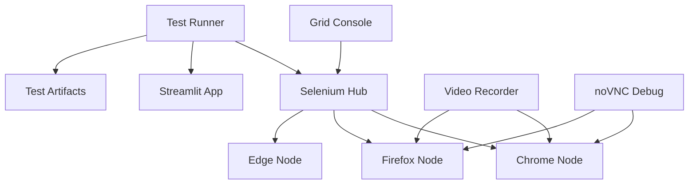

# CrackSeg Docker Testing Infrastructure

Comprehensive Docker-based testing environment for CrackSeg Streamlit GUI with Selenium Grid automation.

## Quick Start

### Using the Specialized Test Runner (Subtask 13.4)

```bash
# Build the specialized test runner
./tests/docker/scripts/run-test-runner.sh build

# Run tests with default configuration
./tests/docker/scripts/run-test-runner.sh run

# Run with custom browser and parallel workers
./tests/docker/scripts/run-test-runner.sh run --browser firefox --parallel-workers 4

# Run with coverage and reporting
./tests/docker/scripts/run-test-runner.sh run --coverage --html-report --json-report

# Run with video recording and monitoring
./tests/docker/scripts/run-test-runner.sh run --videos --monitoring

# View artifacts and reports
./tests/docker/scripts/run-test-runner.sh artifacts list
```

### Traditional Docker Compose

```bash
# Navigate to Docker directory
cd tests/docker

# Start the complete testing environment
docker-compose -f docker-compose.test.yml up --build

# Run with specific browser profiles
docker-compose -f docker-compose.test.yml --profile chrome --profile firefox up

# Clean up
docker-compose -f docker-compose.test.yml down -v
```

## Architecture Overview

### Containerized Test Runner (NEW - Subtask 13.4)

The specialized test runner provides:

- **Optimized Container**: Purpose-built for test execution only
- **Advanced Artifact Management**: Comprehensive result collection and archiving
- **Flexible Configuration**: Environment-based configuration with sensible defaults
- **Multi-Browser Support**: Chrome, Firefox, and Edge support with parallel execution
- **Performance Optimization**: Minimal dependencies, fast startup, efficient resource usage

**Key Components:**

- `Dockerfile.test-runner`: Specialized multi-stage build for testing
- `run-test-runner.sh`: Management script with comprehensive options
- `test-runner.config`: Environment configuration with defaults
- Enhanced `docker-compose.test.yml` service configuration

### Service Architecture



### Container Specialization

| Service | Purpose | Optimization | Image |
|---------|---------|--------------|--------|
| **test-runner** | **Test execution** | **Minimal deps, fast startup** | **Custom specialized** |
| streamlit-app | GUI application | Full app dependencies | Custom multi-stage |
| selenium-hub | Grid coordination | Hub management | selenium/hub:4.27.0 |
| chrome-node | Chrome browser | Browser automation | selenium/node-chrome:4.27.0 |
| firefox-node | Firefox browser | Browser automation | selenium/node-firefox:4.27.0 |
| edge-node | Edge browser | Browser automation | selenium/node-edge:4.27.0 |

## Test Runner Features

### Specialized Dockerfile (Dockerfile.test-runner)

**Multi-stage Build:**

1. **test-base**: Minimal system dependencies
2. **test-deps**: Testing-specific Python packages
3. **test-config**: Test environment configuration
4. **test-runner**: Optimized runtime environment

**Key Features:**

- Dedicated test user for security
- Comprehensive artifact directories
- Minimal application dependencies (no heavy ML libraries)
- Specialized entrypoint script with service health checks
- Performance-optimized environment variables

### Management Script (run-test-runner.sh)

**Capabilities:**

- Build specialized test runner image
- Environment setup with flexible configuration
- Service orchestration and health checking
- Comprehensive artifact management
- Multi-browser parallel execution
- Video recording and monitoring integration

**Configuration Options:**

- Browser selection (chrome, firefox, edge)
- Parallel worker configuration
- Test timeout and debugging settings
- Coverage and reporting toggles
- Video recording and monitoring profiles

### Artifact Management

**Structured Output:**

```txt
test-results/
├── reports/
│   ├── report.html          # HTML test report
│   ├── report.json          # JSON test results
│   └── test-summary.json    # Execution summary
├── coverage/
│   ├── html/               # HTML coverage reports
│   └── coverage.xml        # XML coverage data
├── screenshots/            # Failure screenshots
└── logs/                   # Test execution logs

test-artifacts/             # Additional test artifacts
selenium-videos/            # Browser session recordings
```

## Environment Configuration

### Default Configuration (test-runner.config)

```bash
# Core settings
TEST_BROWSER=chrome
TEST_PARALLEL_WORKERS=auto
TEST_TIMEOUT=300
TEST_HEADLESS=true

# Features
COVERAGE_ENABLED=true
HTML_REPORT_ENABLED=true
JSON_REPORT_ENABLED=true
SCREENSHOT_ON_FAILURE=true
```

### Environment Variables

| Variable | Default | Description |
|----------|---------|-------------|
| `TEST_BROWSER` | `chrome` | Browser(s) for testing |
| `TEST_PARALLEL_WORKERS` | `auto` | Parallel execution workers |
| `TEST_TIMEOUT` | `300` | Test timeout in seconds |
| `TEST_HEADLESS` | `true` | Headless browser mode |
| `COVERAGE_ENABLED` | `true` | Enable coverage reporting |
| `HTML_REPORT_ENABLED` | `true` | Generate HTML reports |
| `JSON_REPORT_ENABLED` | `true` | Generate JSON reports |
| `SCREENSHOT_ON_FAILURE` | `true` | Screenshot on test failure |

## Usage Examples

### Basic Test Execution

```bash
# Simple test run
./tests/docker/scripts/run-test-runner.sh run

# With custom browser
./tests/docker/scripts/run-test-runner.sh run --browser firefox

# Multi-browser testing
./tests/docker/scripts/run-test-runner.sh run --browser chrome,firefox --parallel-workers 2
```

### Advanced Features

```bash
# With video recording
./tests/docker/scripts/run-test-runner.sh run --videos --profiles recording

# With monitoring and debugging
./tests/docker/scripts/run-test-runner.sh run --monitoring --debug

# Performance testing
./tests/docker/scripts/run-test-runner.sh run --parallel-workers 4 --timeout 600
```

### Artifact Management

```bash
# List generated artifacts
./tests/docker/scripts/run-test-runner.sh artifacts list

# Collect artifacts from containers
./tests/docker/scripts/run-test-runner.sh artifacts collect

# Create archive
./tests/docker/scripts/run-test-runner.sh artifacts archive

# Clean up artifacts
./tests/docker/scripts/run-test-runner.sh artifacts clean
```

### Cleanup and Maintenance

```bash
# Clean test runner only
./tests/docker/scripts/run-test-runner.sh clean test-runner

# Clean all containers
./tests/docker/scripts/run-test-runner.sh clean all

# Remove volumes
./tests/docker/scripts/run-test-runner.sh clean volumes

# Remove images
./tests/docker/scripts/run-test-runner.sh clean images
```

## Performance Optimization

### Resource Limits (Test Runner)

```yaml
deploy:
  resources:
    limits:
      memory: 1G
      cpus: '1.0'
    reservations:
      memory: 512M
      cpus: '0.5'
```

### Optimization Features

- **Fast startup**: Minimal dependencies, optimized layers
- **Parallel execution**: Auto-scaling based on available cores
- **Artifact streaming**: Real-time result collection
- **Health monitoring**: Service dependency management
- **Resource efficiency**: Dedicated containers for specific purposes

## Browser Support

| Browser | Container | Features | Status |
|---------|-----------|----------|--------|
| Chrome | `chrome-node` | Full WebDriver support, video recording | ✅ Stable |
| Firefox | `firefox-node` | Full WebDriver support, video recording | ✅ Stable |
| Edge | `edge-node` | Full WebDriver support, optional profile | ✅ Optional |

## Monitoring and Debugging

### Available Profiles

- `recording`: Video recording of browser sessions
- `monitoring`: Grid console and monitoring services
- `debug`: noVNC for interactive debugging
- `edge`: Microsoft Edge browser support

### Debugging Tools

- **Grid Console**: `http://localhost:4446` (with monitoring profile)
- **noVNC Chrome**: `http://localhost:7900` (with debug profile)
- **noVNC Firefox**: `http://localhost:7901` (with debug profile)

## Integration

### CI/CD Integration

```bash
# Headless CI execution
./tests/docker/scripts/run-test-runner.sh run \
  --browser chrome \
  --headless true \
  --parallel-workers auto \
  --coverage \
  --html-report \
  --json-report
```

### Local Development

```bash
# Interactive debugging
./tests/docker/scripts/run-test-runner.sh run \
  --browser chrome \
  --headless false \
  --debug \
  --screenshots \
  --profiles debug
```

## Troubleshooting

### Common Issues

1. **Port conflicts**: Ensure ports 4444, 8501, 7900, 7901 are available
2. **Memory issues**: Adjust parallel workers if system has limited RAM
3. **Browser startup**: Check browser node health and logs
4. **Network connectivity**: Verify Docker network configuration

### Health Checks

```bash
# Check service status
./tests/docker/scripts/run-test-runner.sh status

# View logs
./tests/docker/scripts/run-test-runner.sh logs

# Check Selenium Grid
curl http://localhost:4444/wd/hub/status

# Check Streamlit app
curl http://localhost:8501/_stcore/health
```

## File Structure

```txt
tests/docker/
├── Dockerfile.streamlit              # Streamlit app container
├── Dockerfile.test-runner           # Specialized test runner (NEW)
├── docker-compose.test.yml          # Service orchestration
├── test-runner.config               # Environment configuration (NEW)
├── scripts/
│   ├── run-test-runner.sh          # Test runner management (NEW)
│   ├── manage-grid.sh              # Grid management
│   ├── start-test-env.sh           # Environment startup
│   └── run-e2e-tests.sh           # E2E test execution
├── pytest.ini                      # PyTest configuration
├── grid-config.json                # Selenium Grid configuration
└── README.md                       # This documentation
```

## Requirements

- Docker Engine 20.10+
- Docker Compose V2
- Available ports: 4444, 8501, 7900, 7901, 4446
- Minimum RAM: 4GB (8GB recommended for parallel testing)
- Available disk space: 2GB for containers and artifacts

## Support

For issues or questions about the Docker testing infrastructure:

1. Check the troubleshooting section above
2. Review container logs: `./tests/docker/scripts/run-test-runner.sh logs`
3. Verify service health: `./tests/docker/scripts/run-test-runner.sh status`
4. Check the project's Task Master for related tasks: `task-master show 13`
