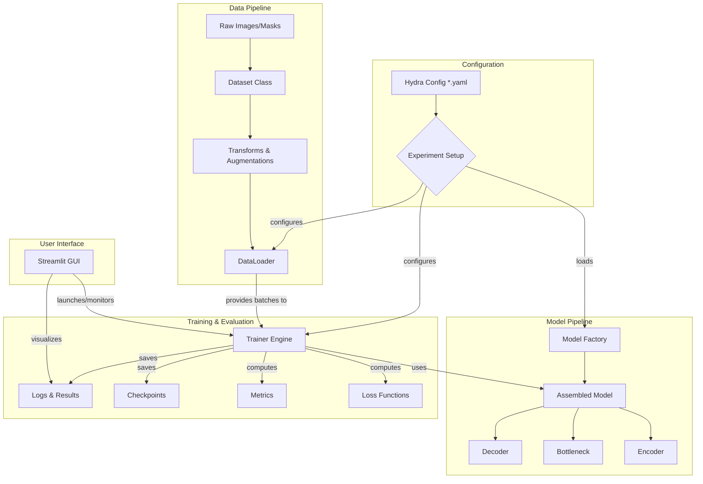

# CrackSeg Technical Architecture

This document provides a detailed overview of the technical architecture of the
CrackSeg project. It is intended for developers who want to understand the system's
design, components, and data flow.

## 1. Architectural Overview

The CrackSeg project is built on a modular, configuration-driven architecture designed
for flexibility, reproducibility, and ease of experimentation. The core principles are:

- **Modularity**: Components like encoders, decoders, and loss functions are
    self-contained and swappable.
- **Configuration as Code**: [Hydra](https://hydra.cc/) manages all configurations,
    allowing for easy parameter changes and experiment tracking without altering the code.
- **Factory Pattern**: A central factory system dynamically instantiates components
    (models, data loaders, etc.) based on the Hydra configuration.
- **Clear Separation of Concerns**: The codebase is organized into distinct sections
    for data handling (`src/data`), model definitions (`src/model`), training logic
    (`src/training`), and user interface (`gui`).

---

## 2. System Architecture Diagram

The following diagram illustrates the high-level data and control flow through the system,
from configuration to results.

---

## 3. Core Component Breakdown

### 3.1. Configuration (`configs/`)

This directory is the heart of the system's flexibility.

- **Structure**: Organized hierarchically to mirror the `src` directory structure
    (e.g., `configs/model/encoder/`).
- **`base.yaml`**: The main configuration file that composes the default experiment setup.
- **Operation**: Hydra reads these YAML files, composes a final configuration object,
    and passes it to the main training script. Users can override any parameter from
    the command line.

### 3.2. Data Pipeline (`src/data/`)

This module is responsible for loading, preprocessing, and serving data to the model.

- `dataset.py`: Contains the main `CrackDataset` class, which loads images and masks
    from disk.
- `dataloader.py` & `factory.py`: Create `DataLoader` instances with specified batching,
    shuffling, and worker configurations.
- `transforms.py`: A collection of data augmentation and normalization functions
    (e.g., resizing, flipping, color jitter) applied to the data.

### 3.3. Model Architecture (`src/model/`)

This module defines all neural network components.

- **`factory/`**: The `create_model_from_config` function acts as the central entry
    point. It reads the configuration and dynamically assembles the requested model.
- **`architectures/`**: Defines end-to-end model structures (e.g., U-Net), which
    are composed of smaller, reusable parts.
- **`encoder/`, `decoder/`, `bottleneck/`**: Contain various implementations of
    model sub-components (e.g., a ResNet encoder, an ASPP bottleneck). These are
    treated as plug-and-play modules.

### 3.4. Training Engine (`src/training/`)

This module contains the logic for training and validating the model.

- `trainer.py` (Assumed location, based on standard practices): A central class or
    script that orchestrates the training loop (epochs, steps, backpropagation).
- **`losses/`**: A registry of loss functions (e.g., DiceLoss, FocalLoss, BCE). The
    configuration specifies which loss to use.
- **`metrics/`**: A collection of evaluation metrics (e.g., IoU, F1-Score) used to
    judge model performance.
- `checkpointing/` (in `src/utils`): Logic for saving and loading model state,
    allowing training to be resumed.

### 3.5. Graphical User Interface (`gui/`)

The Streamlit-based GUI provides an interactive frontend for the system.

- `app.py`: The main entry point for the Streamlit application.
- **`pages/`**: Each file defines a separate page in the GUI (e.g., `page_config.py`,
    `page_train.py`).
- **`components/`**: Reusable UI elements, such as the device selector, progress bars,
    or confirmation dialogs.
- **`services/`**: Backend logic for the GUI, such as managing the training process
    or monitoring GPU usage.

---

## 4. Data and Control Flow

1. **Initialization**: A user launches a run via the GUI or CLI.
2. **Configuration**: Hydra loads and merges YAML files from `configs/` to create a
    single configuration object.
3. **Instantiation**: The `main.py` script uses this configuration to instantiate the
    `DataLoader`, the `Model` (via the model factory), the loss function(s), and the
    trainer.
4. **Training Loop**:
    - The `Trainer` requests a batch of data from the `DataLoader`.
    - The batch is passed through the `Model` to get predictions.
    - The loss between predictions and ground truth is calculated.
    - Gradients are computed, and the optimizer updates the model's weights.
    - Metrics are calculated and logged.
5. **Checkpointing**: The trainer periodically saves the model state and optimizer state
    to disk.
6. **Visualization**: The GUI polls the output directories to update progress bars,
    charts, and result galleries in real-time.
