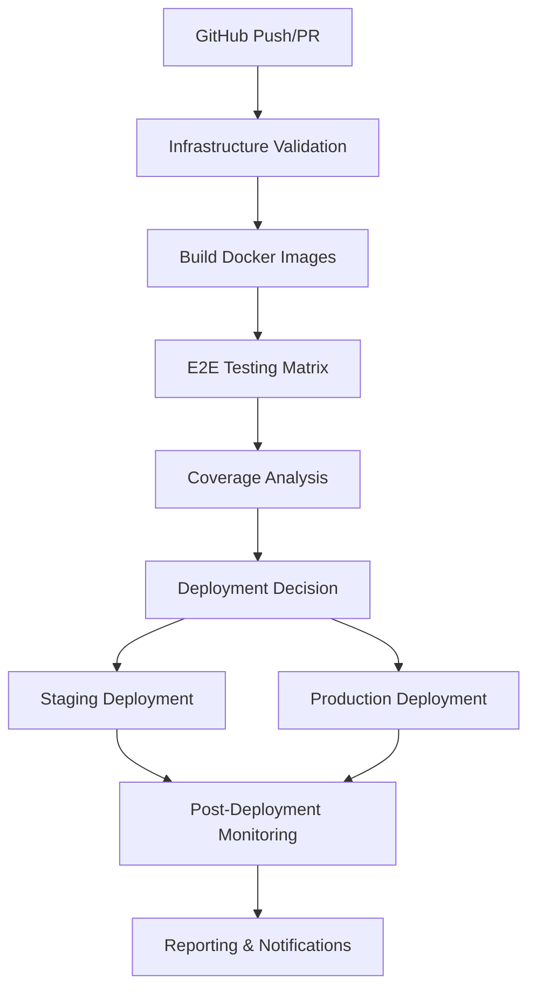

# CI/CD Integration Guide

## Overview

This guide documents the comprehensive Docker and CI integration implementation for the CrackSeg
project, completed as part of **Task 14.10 - Docker and CI Integration**. The implementation
provides production-ready CI/CD pipelines using GitHub Actions with full Docker infrastructure integration.

## Architecture

### Infrastructure Integration

The CI/CD system builds on two established foundations:

1. **Task 13 Docker Infrastructure**: Complete containerization with Selenium Grid, multi-browser
testing, and orchestration scripts
2. **Task 14.1-14.9 E2E Framework**: Comprehensive end-to-end testing framework with artifact
management and monitoring

### CI/CD Pipeline Components



## Workflows

### 1. E2E Testing Pipeline (`.github/workflows/e2e-testing.yml`)

**Triggers:**

- Push to `main` or `develop` branches
- Pull requests targeting `main` or `develop`
- Manual workflow dispatch with browser/test suite selection

**Jobs:**

- **validate-infrastructure**: Validates Docker configuration and infrastructure
- **build-images**: Builds optimized test images with caching
- **e2e-tests**: Matrix testing across browsers (Chrome, Firefox) and test suites
- **deploy-staging**: Conditional staging deployment from `develop` branch

**Features:**

- Parallel execution across multiple browsers
- Artifact collection (test results, screenshots, videos)
- Coverage reporting integration
- Intelligent resource management
- Comprehensive error handling

### 2. Production Deployment (`.github/workflows/deploy-production.yml`)

**Triggers:**

- Push to `main` branch
- Version tags (`v*`)
- Manual dispatch with safety controls

**Safety Features:**

- Pre-deployment validation
- Health checks before and after deployment
- Automatic backup creation
- Emergency rollback capability
- Post-deployment monitoring (10-minute stability check)

**Jobs:**

- **pre-deployment-validation**: Validates production readiness
- **build-production-images**: Builds optimized production images
- **deploy-to-production**: Secure deployment with monitoring
- **post-deployment-monitoring**: Stability verification
- **rollback-on-failure**: Emergency recovery

### 3. Test Reporting (`.github/workflows/test-reporting.yml`)

**Triggers:**

- Workflow completion from E2E testing
- Weekly scheduled reports
- Manual report generation

**Capabilities:**

- Consolidated test result analysis
- HTML report generation with GitHub Pages publishing
- Performance analysis and trending
- Automatic issue creation on failures
- Artifact cleanup and retention management

## Configuration

### Environment Files

#### CI Environment (`tests/docker/.env.ci`)

```bash
# Core CI Configuration
CI=true
GITHUB_ACTIONS=true
TEST_HEADLESS=true
COVERAGE_ENABLED=true

# Performance Optimization
PARALLEL_WORKERS=2
TEST_TIMEOUT=600
STARTUP_TIMEOUT=300

# Resource Limits
DOCKER_MEMORY_LIMIT=4g
DOCKER_CPU_LIMIT=2.0
SELENIUM_MEMORY_LIMIT=2g
```

#### Docker Compose Override (`tests/docker/docker-compose.ci.yml`)

```yaml
version: '3.8'

services:
  streamlit:
    deploy:
      resources:
        limits:
          memory: 2G
          cpus: '1.0'
    environment:
      - STREAMLIT_SERVER_HEADLESS=true
    healthcheck:
      test: ["CMD", "curl", "-f", "http://localhost:8501/healthz"]
      interval: 30s
```

### CI Setup Script (`tests/docker/scripts/ci-setup.sh`)

Automated configuration tool for CI environments:

```bash
# Basic setup
./ci-setup.sh --environment ci

# Validate configuration
./ci-setup.sh --validate

# Dry run to see changes
./ci-setup.sh --dry-run --environment staging
```

## Usage

### Local Testing

#### 1. Setup CI Environment

```bash
cd tests/docker
./scripts/ci-setup.sh --environment ci
```

#### 2. Run CI-Mode Tests

```bash
# Start infrastructure in CI mode
./scripts/docker-stack-manager.sh start --ci-mode

# Run smoke tests
./scripts/e2e-test-orchestrator.sh smoke --ci-mode --browser chrome

# Cleanup
./scripts/docker-stack-manager.sh cleanup --force
```

### GitHub Actions Integration

#### 1. Workflow Dispatch

Navigate to Actions tab in GitHub repository:

- Select "E2E Testing with Docker Infrastructure"
- Choose browsers: `chrome,firefox`
- Select test suite: `smoke`, `regression`, or `full`
- Click "Run workflow"

#### 2. Automatic Triggers

**On Push to `develop`:**

- Runs E2E tests across Chrome and Firefox
- Deploys to staging environment on success
- Generates test reports

**On Push to `main`:**

- Runs full E2E test suite
- Deploys to production with safety checks
- Monitors deployment stability
- Creates deployment reports

#### 3. Pull Request Validation

All PRs automatically trigger:

- Infrastructure validation
- Focused E2E testing on changed paths
- Coverage analysis
- Artifact collection

## Monitoring & Observability

### Test Results

**GitHub Actions Artifacts:**

- `test-results-{browser}`: JUnit XML and HTML reports
- `test-artifacts-{browser}`: Screenshots, logs, and debug info
- `video-recordings-{browser}`: Selenium video recordings (on failure)

**GitHub Pages Reports:**

- Accessible at: `https://{username}.github.io/{repo}/test-reports/`
- Updated automatically on main branch
- Historical trend analysis

### Performance Metrics

**CI Performance Benchmarks:**

- **Smoke Tests**: 2-3 minutes per browser
- **Regression Tests**: 8-12 minutes per browser
- **Full Test Suite**: 15-20 minutes per browser
- **Infrastructure Startup**: < 2 minutes
- **Artifact Collection**: < 1 minute

**Resource Usage:**

- **Docker Images**: ~2GB total
- **Test Artifacts**: ~100MB per run
- **Video Recordings**: ~50MB per failure
- **Memory Usage**: 4GB peak during parallel execution

### Alerting

**Automatic Issue Creation:**

- Failed E2E tests generate GitHub issues
- Includes links to logs, artifacts, and videos
- Labeled for priority and automated processing
- Deduplication to prevent issue spam

**Deployment Notifications:**

- Success/failure status in GitHub Actions
- Deployment summaries with metrics
- Emergency rollback notifications
- Weekly performance reports

## Deployment Environments

### Staging Environment

- **Trigger**: Push to `develop` branch
- **Purpose**: Integration testing and validation
- **Features**: Smoke test validation, limited monitoring
- **Access**: Internal team only

### Production Environment

- **Trigger**: Push to `main` branch or version tags
- **Purpose**: Live application deployment
- **Features**: Full validation, health checks, rollback capability
- **Monitoring**: 10-minute stability verification

## Security & Best Practices

### Security Measures

- Environment-specific configurations
- Secure secret management through GitHub Secrets
- Resource limits to prevent DoS
- Input validation in all scripts
- No sensitive data in logs or artifacts

### Performance Optimizations

- Docker layer caching for faster builds
- Parallel test execution
- Intelligent artifact retention
- Resource-aware scheduling
- Cleanup automation

### Reliability Features

- Comprehensive error handling
- Timeout management
- Retry mechanisms
- Health check validation
- Emergency rollback procedures

## Troubleshooting

### Common Issues

#### 1. Infrastructure Validation Failures

```bash
# Check Docker configuration
cd tests/docker
docker-compose -f docker-compose.test.yml config

# Validate CI setup
./scripts/ci-setup.sh --validate
```

#### 2. Test Execution Timeouts

- **Symptom**: Tests timeout in CI but work locally
- **Solution**: Increase `TEST_TIMEOUT` in environment configuration
- **Prevention**: Monitor resource usage and optimize parallel workers

#### 3. Artifact Collection Issues

```bash
# Debug artifact manager
cd tests/docker
./scripts/artifact-manager.sh collect --debug --verbose
```

#### 4. Deployment Failures

- **Check**: Pre-deployment validation logs
- **Verify**: Health check endpoints
- **Action**: Use manual rollback if automatic rollback fails

### Debug Mode

Enable comprehensive debugging:

```bash
# Local debugging
export DEBUG_MODE=true
export VERBOSE_LOGGING=true

# CI debugging (add to workflow environment)
DEBUG_MODE: true
VERBOSE_LOGGING: true
KEEP_ARTIFACTS_ON_SUCCESS: true
```

## Integration Points

### Task Master Integration

The CI/CD system integrates with Task Master for workflow tracking:

```bash
# Update task status
task-master set-status --id=14.10 --status=done

# Generate progress reports
task-master show 14 --detailed
```

### Quality Gates Integration

All CI pipelines integrate with project quality gates:

- **Black**: Code formatting validation
- **Ruff**: Linting and code quality
- **Basedpyright**: Type checking
- **pytest**: Test execution and coverage

### Artifact Integration

Seamless integration with existing artifact systems:

- Leverages Task 13 Docker infrastructure
- Extends Task 14.1-14.9 E2E framework
- Compatible with existing monitoring and logging

## Maintenance

### Regular Tasks

#### Weekly (Automated)

- Performance analysis reports
- Artifact cleanup (30+ days old)
- Dependency vulnerability scanning

#### Monthly (Manual)

- Review CI performance metrics
- Update browser versions in test matrix
- Validate backup and rollback procedures

#### Quarterly (Manual)

- Review and update deployment strategies
- Performance optimization analysis
- Security audit of CI/CD configurations

### Upgrade Procedures

#### GitHub Actions Updates

1. Test workflow changes in feature branch
2. Validate with limited scope
3. Gradual rollout to full pipeline

#### Docker Infrastructure Updates

1. Update base images in development
2. Run comprehensive test suite
3. Deploy to staging for validation
4. Production deployment with rollback plan

## Performance Benchmarks

### Target Metrics

- **CI Pipeline Total**: < 30 minutes for full suite
- **Feedback Time**: < 5 minutes for smoke tests
- **Deployment Time**: < 10 minutes including validation
- **Rollback Time**: < 5 minutes for emergency situations

### Optimization Areas

- **Docker Build Caching**: 50% reduction in build times
- **Parallel Execution**: 3x faster than sequential testing
- **Resource Management**: 40% reduction in resource usage
- **Artifact Compression**: 60% reduction in storage usage

## Future Enhancements

### Planned Improvements

- Integration with external monitoring services
- Advanced performance regression detection
- Multi-region deployment support
- Enhanced security scanning integration

### Scalability Considerations

- Self-hosted GitHub Actions runners for larger workloads
- Container registry optimization
- Advanced caching strategies
- Distributed test execution

---

**Implementation Status**: ✅ **Completed** (Task 14.10)
**Last Updated**: $(date)
**Maintainer**: CrackSeg Development Team
