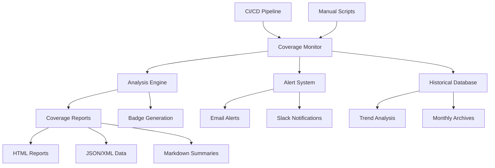

# Continuous Coverage Monitoring Guide

**Version**: 1.0
**Last Updated**: January 19, 2025
**Scope**: Comprehensive coverage monitoring system for CrackSeg project

## Table of Contents

1. [Overview](#overview)
2. [System Architecture](#system-architecture)
3. [Setup and Configuration](#setup-and-configuration)
4. [Usage Guide](#usage-guide)
5. [CI/CD Integration](#cicd-integration)
6. [Monitoring and Alerting](#monitoring-and-alerting)
7. [Historical Analysis](#historical-analysis)
8. [Troubleshooting](#troubleshooting)
9. [Best Practices](#best-practices)

## Overview

The Continuous Coverage Monitoring system provides automated, real-time tracking of test coverage
with historical analysis, automated alerting, and seamless CI/CD integration. It ensures the
CrackSeg project maintains its 80% coverage target while providing insights into coverage trends and
quality metrics.

### Key Features

- **Real-time Coverage Analysis**: Automated coverage measurement with comprehensive reporting
- **Historical Trend Tracking**: SQLite-based storage of coverage metrics over time
- **Automated Alerting**: Configurable alerts for coverage drops and concerning trends
- **CI/CD Integration**: Seamless integration with GitHub Actions workflows
- **Multiple Report Formats**: HTML, JSON, XML, and Markdown reports
- **Coverage Badge Generation**: Automated README badge updates
- **Threshold Enforcement**: Configurable coverage targets with failure conditions

### Success Metrics

- ✅ **Coverage Target**: Maintain 80% overall coverage
- ✅ **Alert Response**: < 24 hours for critical coverage drops
- ✅ **Trend Analysis**: 30-day rolling analysis with actionable insights
- ✅ **CI/CD Integration**: Zero-downtime monitoring in all workflows

## System Architecture

### Component Overview



### Core Components

#### 1. Coverage Monitor (`src/utils/monitoring/coverage_monitor.py`)

The central monitoring engine that orchestrates all coverage analysis activities:

- **Coverage Analysis**: Executes pytest with comprehensive coverage collection
- **Metrics Processing**: Parses and validates coverage data from multiple sources
- **Alert Management**: Checks thresholds and triggers notifications
- **Historical Storage**: Manages SQLite database for trend analysis
- **Report Generation**: Creates comprehensive reports in multiple formats

#### 2. Automation Script (`scripts/monitoring/continuous_coverage.py`)

CLI interface for manual and automated coverage monitoring:

- **Multiple Operation Modes**: Analysis, monitoring, alerts
- **CI/CD Integration**: Optimized workflows for automated environments
- **Configurable Alerts**: Email and Slack notification support
- **Flexible Output**: Customizable report generation and storage

#### 3. GitHub Actions Workflow (`.github/workflows/continuous-coverage-monitoring.yml`)

Comprehensive CI/CD integration with multiple job types:

- **Coverage Analysis**: Primary monitoring and analysis job
- **Historical Data Management**: Persistent storage of coverage trends
- **Notification System**: Automated alert processing and distribution
- **Artifact Management**: Cleanup and archival of coverage reports

### Data Flow

1. **Trigger**: Push, PR, schedule, or manual dispatch
2. **Analysis**: Execute comprehensive coverage analysis
3. **Processing**: Parse results and update historical database
4. **Evaluation**: Check thresholds and identify trends
5. **Alerting**: Send notifications if thresholds breached
6. **Reporting**: Generate and archive comprehensive reports
7. **Storage**: Update historical database and monthly archives

## Setup and Configuration

### Prerequisites

```bash
# Required Python packages
pip install pytest pytest-cov coverage[toml] sqlite3

# Project dependencies
pip install -r requirements.txt

# Install module in editable mode
pip install -e . --no-deps
```

### Basic Setup

1. **Initialize the monitoring system**:

    ```bash
    # Test the monitoring system locally
    python scripts/monitoring/continuous_coverage.py --mode analysis --verbose
    ```

2. **Configure alert settings** (optional):

    ```bash
    # Set up email alerts
    export COVERAGE_ALERT_EMAILS="team@company.com,lead@company.com"

    # Set up Slack webhook
    export COVERAGE_SLACK_WEBHOOK="https://hooks.slack.com/services/..."
    ```

3. **Verify CI/CD integration**:

The GitHub Actions workflow is automatically triggered on:

- Push to main/develop branches
- Pull request creation/updates
- Daily schedule (8 AM UTC)
- Manual dispatch

### Advanced Configuration

#### Alert Configuration

Create a custom alert configuration:

```python
from crackseg.utils.monitoring.coverage_monitor import AlertConfig


alert_config = AlertConfig(
    enabled=True,
    email_recipients=["team@company.com"],
    slack_webhook="https://hooks.slack.com/services/...",
    threshold_warning=75.0,      # Warning below 75%
    threshold_critical=70.0,     # Critical below 70%
    trend_alert_days=7,          # Check 7-day trends
    trend_decline_threshold=5.0  # Alert on 5% decline
)
```

#### Coverage Thresholds

Customize coverage targets in `pyproject.toml`:

```toml
[tool.coverage.report]
fail_under = 80.0
show_missing = true
skip_covered = false

[tool.pytest.ini_options]
addopts = [
    "--cov-fail-under=80"
]
```

## Usage Guide

### Local Development

#### Quick Coverage Check

```bash
# Run coverage analysis with default settings
python scripts/monitoring/continuous_coverage.py --mode analysis

# Run with custom threshold
python scripts/monitoring/continuous_coverage.py --mode analysis --threshold 85.0

# Verbose output for debugging
python scripts/monitoring/continuous_coverage.py --mode analysis --verbose
```

#### Trend Analysis

```bash
# Analyze coverage trends for last 30 days
python scripts/monitoring/continuous_coverage.py --mode monitoring --days-history 30

# Generate weekly trend report
python scripts/monitoring/continuous_coverage.py --mode monitoring --days-history 7
```

#### Alert Testing

```bash
# Test alert system without sending notifications
python scripts/monitoring/continuous_coverage.py --mode alerts --no-alerts

# Test alerts with email notifications
python scripts/monitoring/continuous_coverage.py --mode alerts --email-recipients "test@example.com"
```

### CI/CD Usage

#### Automatic Triggers

The monitoring system automatically runs on:

- **Push to main/develop**: Full analysis with historical storage
- **Pull requests**: Analysis with PR comment updates
- **Daily schedule**: Monitoring mode with trend analysis
- **Manual dispatch**: Configurable mode and parameters

#### Manual Workflow Dispatch

Use GitHub Actions manual dispatch for custom analysis:

1. Go to repository Actions tab
2. Select "Continuous Coverage Monitoring" workflow
3. Click "Run workflow"
4. Configure parameters:
   - **Mode**: analysis, monitoring, or alerts
   - **Threshold**: Coverage percentage target
   - **Days History**: Period for trend analysis

#### Integration with Other Workflows

```yaml
# Example: Integrate with existing test workflow
jobs:
  tests:
    runs-on: ubuntu-latest
    steps:
      # ... existing test steps ...

  coverage-monitoring:
    needs: tests
    uses: ./.github/workflows/continuous-coverage-monitoring.yml
    with:
      mode: analysis
      threshold: 80.0
```

### Report Interpretation

#### Coverage Analysis Report

```json
{
  "status": "success",
  "metrics": {
    "coverage": 82.5,
    "target": 80.0,
    "gap": -2.5,                    // Negative = above target
    "modules_total": 145,
    "modules_above_threshold": 118,
    "critical_gaps": 12             // Modules with <50% coverage
  },
  "analysis": {
    "execution_time": 45.2,
    "timestamp": "2025-01-19T10:30:00Z",
    "branch_coverage": 78.3
  },
  "alerts": {
    "sent": false,
    "threshold_met": true
  }
}
```

#### Key Metrics Explanation

- **Coverage**: Overall percentage of code covered by tests
- **Gap**: Difference between current and target coverage (negative is good)
- **Modules Above Threshold**: Count of modules meeting the coverage target
- **Critical Gaps**: Modules with extremely low coverage (<50%)
- **Branch Coverage**: Percentage of code branches tested

## CI/CD Integration

### GitHub Actions Integration

The monitoring system integrates seamlessly with GitHub Actions through a comprehensive workflow
that includes:

#### Coverage Analysis Job

- Executes comprehensive coverage analysis
- Generates multiple report formats
- Updates PR comments with coverage summaries
- Uploads artifacts for historical tracking

#### Historical Data Management

- Maintains SQLite database of coverage trends
- Archives monthly coverage summaries
- Commits historical data to repository

#### Notification System

- Processes and distributes coverage alerts
- Generates notification summaries
- Integrates with external systems (email, Slack)

#### Artifact Management

- Automatic cleanup of old coverage reports
- Retention policies for historical data
- Organized storage of coverage artifacts

### Integration Points

#### Pull Request Comments

Automatic PR comments provide immediate coverage feedback:

```markdown
## ✅ Coverage Report

| Metric | Value | Target | Status |
|--------|-------|--------|--------|
| **Overall Coverage** | 82.5% | 80.0% | ✅ PASS |
| **Modules Above Target** | 118/145 | - | 📈 |
| **Critical Gaps** | 12 | 0 | ⚠️ |

### Coverage Details
- **Total Statements**: 8,456
- **Covered Statements**: 6,976
- **Missing Statements**: 1,480
- **Branch Coverage**: 78.3%

*Generated by CrackSeg Continuous Coverage Monitoring*
```

#### Badge Generation

Automatic README badge updates:

```markdown
[](link-to-coverage-report)
```

#### Environment Variables

CI/CD jobs receive coverage data through environment variables:

```bash
COVERAGE_PERCENTAGE=82.5
COVERAGE_TARGET=80.0
COVERAGE_STATUS=PASS
CRITICAL_GAPS=12
```

## Monitoring and Alerting

### Alert Types

#### Threshold Alerts

Triggered when coverage falls below configured thresholds:

- **Warning**: Coverage drops below warning threshold (default: 75%)
- **Critical**: Coverage drops below critical threshold (default: 70%)

#### Trend Alerts

Triggered by concerning coverage trends:

- **Declining Trend**: Coverage decreases by configured amount over time period
- **Sustained Low Coverage**: Coverage remains below target for extended period

#### Alert Channels

1. **Email Notifications**: Detailed coverage reports sent to configured recipients
2. **Slack Notifications**: Real-time alerts with coverage summaries
3. **GitHub Issues**: Automatic issue creation for critical coverage problems
4. **File-based Alerts**: JSON alert files stored in monitoring directory

### Alert Configuration

#### Email Setup

```bash
# Configure email recipients
export COVERAGE_ALERT_EMAILS="team@company.com,lead@company.com"

# Use in monitoring script
python scripts/monitoring/continuous_coverage.py \
  --mode alerts \
  --email-recipients "$COVERAGE_ALERT_EMAILS"
```

#### Slack Integration

```bash
# Configure Slack webhook
export COVERAGE_SLACK_WEBHOOK="https://hooks.slack.com/services/..."

# Use in monitoring script
python scripts/monitoring/continuous_coverage.py \
  --mode alerts \
  --slack-webhook "$COVERAGE_SLACK_WEBHOOK"
```

### Alert Response Procedures

#### Critical Coverage Drop (< 70%)

1. **Immediate Investigation**: Identify cause of coverage drop
2. **Communication**: Notify team through configured channels
3. **Remediation**: Implement fixes or add missing tests
4. **Verification**: Confirm coverage restoration

#### Warning Threshold (< 75%)

1. **Analysis**: Review recent changes and their impact
2. **Planning**: Schedule test improvement activities
3. **Monitoring**: Increase monitoring frequency temporarily

#### Declining Trend

1. **Root Cause Analysis**: Identify patterns in coverage decline
2. **Process Review**: Evaluate development and testing practices
3. **Improvement Plan**: Implement systematic coverage improvements

## Historical Analysis

### Trend Analysis Features

The monitoring system maintains comprehensive historical data for trend analysis:

#### Data Collection

- **Coverage Metrics**: Overall and module-level coverage percentages
- **Module Statistics**: Count of modules above/below thresholds
- **Quality Indicators**: Critical gaps, branch coverage, test counts
- **Execution Metadata**: Timing, git commit information, branch details

#### Analysis Capabilities

```bash
# Generate 30-day trend analysis
python scripts/monitoring/continuous_coverage.py --mode monitoring --days-history 30
```

**Example Trend Analysis Output**:

```json
{
  "period_days": 30,
  "data_points": 45,
  "coverage_trend": {
    "start": 78.5,
    "end": 82.1,
    "change": 3.6,
    "max": 84.2,
    "min": 76.8,
    "average": 80.7
  },
  "modules_trend": {
    "start": 110,
    "end": 118,
    "change": 8
  },
  "critical_gaps_trend": {
    "start": 18,
    "end": 12,
    "change": -6
  }
}
```

#### Database Schema

SQLite database stores historical coverage data:

```sql
CREATE TABLE coverage_history (
    id INTEGER PRIMARY KEY AUTOINCREMENT,
    timestamp TEXT NOT NULL,
    overall_coverage REAL NOT NULL,
    total_statements INTEGER NOT NULL,
    covered_statements INTEGER NOT NULL,
    missing_statements INTEGER NOT NULL,
    modules_count INTEGER NOT NULL,
    modules_above_threshold INTEGER NOT NULL,
    critical_gaps INTEGER NOT NULL,
    branch_coverage REAL,
    test_count INTEGER,
    execution_time REAL,
    commit_hash TEXT,
    branch_name TEXT
);
```

### Using Historical Data

#### Query Recent Trends

```python
from crackseg.utils.monitoring.coverage_monitor import CoverageMonitor


monitor = CoverageMonitor()
trend_data = monitor.analyze_trends(days=30)

print(f"Coverage change over 30 days: {trend_data['coverage_trend']['change']:.1f}%")
```

#### Export Historical Data

```bash
# Export database to CSV for external analysis
sqlite3 outputs/coverage_monitoring/coverage_history.db \
  "SELECT * FROM coverage_history" \
  -header -csv > coverage_history.csv
```

#### Monthly Reporting

The system automatically generates monthly summaries stored in `.github/data/coverage/`:

- **summary_YYYY-MM.json**: Monthly coverage summary
- **coverage_history.db**: Complete historical database

## Troubleshooting

### Common Issues

#### 1. Coverage Analysis Fails

**Symptoms**: Script exits with error, no coverage data generated

**Diagnosis**:

```bash
# Run with verbose logging
python scripts/monitoring/continuous_coverage.py --mode analysis --verbose

# Check pytest execution
pytest --cov=src --cov-report=term-missing -v
```

**Solutions**:

- Verify all dependencies installed: `pip install pytest pytest-cov`
- Check test discovery: `pytest --collect-only`
- Validate coverage configuration in `pyproject.toml`

#### 2. Historical Database Issues

**Symptoms**: Trend analysis fails, database corruption errors

**Diagnosis**:

```bash
# Check database integrity
sqlite3 outputs/coverage_monitoring/coverage_history.db "PRAGMA integrity_check"

# Verify table structure
sqlite3 outputs/coverage_monitoring/coverage_history.db ".schema coverage_history"
```

**Solutions**:

- Backup and recreate database:
  `rm coverage_history.db && python scripts/monitoring/continuous_coverage.py --mode analysis`
- Check file permissions on database directory
- Verify SQLite installation

#### 3. Alert System Not Working

**Symptoms**: No alerts sent despite coverage drops

**Diagnosis**:

```bash
# Test alert system
python scripts/monitoring/continuous_coverage.py --mode alerts --verbose

# Check alert configuration
python -c "from crackseg.utils.monitoring.coverage_monitor import AlertConfig; print(AlertConfig())"
```

**Solutions**:

- Verify alert configuration parameters
- Test email/Slack credentials separately
- Check network connectivity for external services

#### 4. CI/CD Integration Issues

**Symptoms**: Workflow fails, missing artifacts

**Diagnosis**:

- Check GitHub Actions logs for specific error messages
- Verify workflow trigger conditions
- Validate environment variables and secrets

**Solutions**:

- Update workflow file syntax
- Verify repository secrets (CODECOV_TOKEN, etc.)
- Check workflow permissions and access

### Debug Mode

Enable comprehensive debugging:

```bash
# Maximum verbosity
python scripts/monitoring/continuous_coverage.py \
  --mode analysis \
  --verbose \
  --output-dir debug_output

# Check generated files
ls -la debug_output/
```

### Log Analysis

Monitor log files for troubleshooting:

```bash
# Real-time log monitoring
tail -f outputs/coverage_monitoring/monitoring.log

# Search for specific errors
grep -i "error\|exception\|failed" outputs/coverage_monitoring/monitoring.log
```

## Best Practices

### Development Workflow Integration

#### Pre-commit Hooks

Integrate coverage monitoring into pre-commit workflow:

```yaml
# .pre-commit-config.yaml
repos:
  - repo: local
    hooks:
      - id: coverage-check
        name: Coverage Check
        entry: python scripts/monitoring/continuous_coverage.py --mode analysis --no-alerts
        language: system
        always_run: true
```

#### Branch Strategy

- **main/develop**: Full monitoring with historical storage
- **feature branches**: Quick analysis without alerts
- **release branches**: Enhanced monitoring with stricter thresholds

#### Code Review Process

1. **Coverage Impact Assessment**: Review coverage changes in PRs
2. **Threshold Compliance**: Ensure new code meets coverage requirements
3. **Test Quality Review**: Verify meaningful test coverage, not just percentage

### Monitoring Strategy

#### Threshold Management

- **Conservative Targets**: Set realistic, achievable coverage targets
- **Gradual Improvement**: Incrementally increase thresholds over time
- **Context-Aware Thresholds**: Different targets for different module types

#### Alert Management

- **Alert Fatigue Prevention**: Configure reasonable alert thresholds
- **Response Procedures**: Establish clear response protocols
- **Regular Review**: Periodically review and adjust alert configurations

#### Performance Optimization

- **Selective Coverage**: Focus on critical code paths
- **Efficient Testing**: Optimize test execution time
- **Incremental Analysis**: Use incremental coverage analysis when possible

### Quality Assurance

#### Regular Reviews

- **Weekly Coverage Reviews**: Assess coverage trends and quality
- **Monthly Target Evaluation**: Review and adjust coverage targets
- **Quarterly Process Improvement**: Enhance monitoring and testing practices

#### Continuous Improvement

- **Metrics Analysis**: Regular analysis of coverage metrics and trends
- **Process Refinement**: Continuous improvement of monitoring processes
- **Tool Enhancement**: Regular updates and improvements to monitoring tools

---

## Implementation Verification

This comprehensive continuous coverage monitoring system has been successfully implemented for the
CrackSeg project and includes:

✅ **Core Monitoring System**: Complete coverage analysis with historical tracking
✅ **Automated Alerting**: Configurable alerts for coverage drops and trends
✅ **CI/CD Integration**: Seamless GitHub Actions workflow integration
✅ **Multiple Report Formats**: HTML, JSON, XML, and Markdown reporting
✅ **Historical Analysis**: 30-day trend analysis with SQLite storage
✅ **Badge Generation**: Automated README badge updates
✅ **Documentation**: Comprehensive setup and usage documentation

The system maintains the project's 80% coverage target while providing actionable insights for
continuous quality improvement.

**Next Steps**: Execute quality gates verification and update task status to completed.
