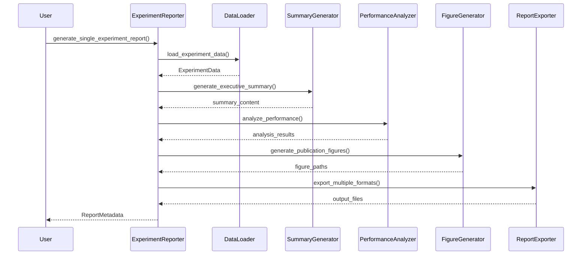
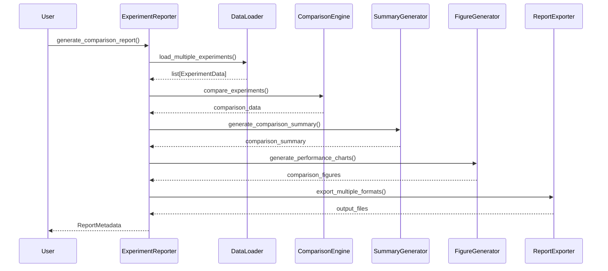

# ExperimentReporter Architecture

## Overview

The ExperimentReporter is a comprehensive reporting system designed to generate automated
executive summaries, detailed performance analysis, experiment comparisons, and publication-ready
figures for crack segmentation experiments.

## System Architecture

### High-Level Design

```mermaid
graph TB
    subgraph "ExperimentReporter Core"
        A[ExperimentReporter] --> B[DataLoader]
        A --> C[SummaryGenerator]
        A --> D[PerformanceAnalyzer]
        A --> E[ComparisonEngine]
        A --> F[FigureGenerator]
        A --> G[TemplateManager]
        A --> H[RecommendationEngine]
        A --> I[ReportExporter]
    end

    subgraph "Input Sources"
        J[Experiment Directories] --> B
        K[Configuration Files] --> B
        L[Metrics Data] --> B
    end

    subgraph "Output Formats"
        A --> M[Markdown Reports]
        A --> N[HTML Reports]
        A --> O[LaTeX Reports]
        A --> P[PDF Reports]
        A --> Q[JSON Reports]
    end

    subgraph "Generated Content"
        A --> R[Executive Summaries]
        A --> S[Performance Analysis]
        A --> T[Experiment Comparisons]
        A --> U[Publication Figures]
        A --> V[Recommendations]
    end
```



### Core Components

#### 1. ExperimentReporter (Orchestrator)

**Purpose**: Main orchestrator that coordinates all reporting components

**Responsibilities**:

- Coordinate data loading from experiment directories
- Generate comprehensive report content
- Export reports in multiple formats
- Manage report metadata and generation tracking

**Key Methods**:

```python
def generate_single_experiment_report(
    self,
    experiment_dir: Path,
    report_type: TemplateType | None = None,
) -> ReportMetadata

def generate_comparison_report(
    self,
    experiment_dirs: list[Path],
    report_type: TemplateType | None = None,
) -> ReportMetadata
```

#### 2. DataLoader

**Purpose**: Load and validate experiment data from directories

**Responsibilities**:

- Parse experiment configuration files
- Load metrics and performance data
- Validate experiment directory structure
- Handle multiple experiment loading

**Interface**:

```python
def load_experiment_data(self, experiment_dir: Path) -> ExperimentData
def load_multiple_experiments(self, experiment_dirs: list[Path]) -> list[ExperimentData]
```

#### 3. SummaryGenerator

**Purpose**: Generate executive summaries and comparison summaries

**Responsibilities**:

- Create executive summaries for single experiments
- Generate comparison summaries for multiple experiments
- Extract key insights and highlights
- Format summaries for different audiences

**Interface**:

```python
def generate_executive_summary(
    self,
    experiment_data: ExperimentData,
    config: ReportConfig,
) -> dict[str, Any]

def generate_comparison_summary(
    self,
    experiments_data: list[ExperimentData],
    config: ReportConfig,
) -> dict[str, Any]
```

#### 4. PerformanceAnalyzer

**Purpose**: Analyze performance metrics and generate insights

**Responsibilities**:

- Analyze training metrics and trends
- Detect performance anomalies
- Generate actionable recommendations
- Evaluate against performance thresholds

**Interface**:

```python
def analyze_performance(
    self,
    experiment_data: ExperimentData,
    config: ReportConfig,
) -> dict[str, Any]

def detect_anomalies(
    self,
    experiments_data: list[ExperimentData],
    config: ReportConfig,
) -> dict[str, Any]

def generate_recommendations(
    self,
    experiment_data: ExperimentData,
    config: ReportConfig,
) -> list[str]
```

#### 5. ComparisonEngine

**Purpose**: Compare multiple experiments and identify best performers

**Responsibilities**:

- Compare experiments across multiple metrics
- Identify best performing experiments
- Generate comparison tables and charts
- Rank experiments by performance criteria

**Interface**:

```python
def compare_experiments(
    self,
    experiments_data: list[ExperimentData],
    config: ReportConfig,
) -> dict[str, Any]

def identify_best_performing(
    self,
    experiments_data: list[ExperimentData],
    config: ReportConfig,
) -> dict[str, Any]

def generate_comparison_table(
    self,
    experiments_data: list[ExperimentData],
    config: ReportConfig,
) -> dict[str, Any]
```

#### 6. FigureGenerator

**Purpose**: Generate publication-ready figures and charts

**Responsibilities**:

- Create training curves and performance charts
- Generate publication-ready figures
- Apply consistent styling and formatting
- Export figures in multiple formats

**Interface**:

```python
def generate_training_curves(
    self,
    experiment_data: ExperimentData,
    config: ReportConfig,
    save_path: Path | None = None,
) -> Path

def generate_performance_charts(
    self,
    experiment_data: ExperimentData,
    config: ReportConfig,
    save_path: Path | None = None,
) -> Path

def generate_publication_figures(
    self,
    experiment_data: ExperimentData,
    config: ReportConfig,
    save_path: Path | None = None,
) -> dict[str, Path]
```

#### 7. TemplateManager

**Purpose**: Manage report templates and rendering

**Responsibilities**:

- Load and manage report templates
- Render templates with experiment data
- Support multiple template types
- Handle custom template directories

**Interface**:

```python
def load_template(
    self,
    template_type: str,
    config: ReportConfig,
) -> str

def render_template(
    self,
    template_content: str,
    data: dict[str, Any],
    config: ReportConfig,
) -> str

def get_available_templates(self) -> list[str]
```

#### 8. RecommendationEngine

**Purpose**: Generate automated recommendations and insights

**Responsibilities**:

- Analyze training patterns and trends
- Suggest hyperparameter improvements
- Identify optimization opportunities
- Generate actionable insights

**Interface**:

```python
def analyze_training_patterns(
    self,
    experiment_data: ExperimentData,
    config: ReportConfig,
) -> list[str]

def suggest_hyperparameter_improvements(
    self,
    experiment_data: ExperimentData,
    config: ReportConfig,
) -> dict[str, Any]

def identify_optimization_opportunities(
    self,
    experiment_data: ExperimentData,
    config: ReportConfig,
) -> list[str]
```

#### 9. ReportExporter

**Purpose**: Export reports in multiple formats

**Responsibilities**:

- Export reports in Markdown, HTML, LaTeX, PDF, JSON
- Handle format-specific rendering
- Manage output file organization
- Support compression and metadata

**Interface**:

```python
def export_report(
    self,
    content: dict[str, Any],
    output_format: str,
    output_path: Path,
    config: ReportConfig,
) -> Path

def export_multiple_formats(
    self,
    content: dict[str, Any],
    output_formats: list[str],
    output_dir: Path,
    config: ReportConfig,
) -> dict[str, Path]
```

## Configuration System

### ReportConfig

The system uses a comprehensive configuration class that controls all aspects of report generation:

```python
@dataclass
class ReportConfig:
    # Output settings
    output_formats: list[OutputFormat]
    output_dir: Path
    template_type: TemplateType

    # Content settings
    include_performance_analysis: bool
    include_comparison_charts: bool
    include_publication_figures: bool
    include_recommendations: bool
    include_trend_analysis: bool

    # Visualization settings
    figure_dpi: int
    figure_format: str
    chart_theme: str
    color_palette: str

    # Analysis settings
    performance_thresholds: dict[str, float]
    trend_analysis_window: int
    anomaly_detection_enabled: bool
```

### Template Types

The system supports multiple template types for different use cases:

- **EXECUTIVE_SUMMARY**: High-level summaries for stakeholders
- **TECHNICAL_DETAILED**: Detailed technical analysis
- **PUBLICATION_READY**: Academic publication format
- **COMPARISON_REPORT**: Multi-experiment comparison
- **PERFORMANCE_ANALYSIS**: Focused performance analysis

### Output Formats

Supported output formats:

- **MARKDOWN**: Lightweight, readable format
- **HTML**: Interactive web format
- **LATEX**: Academic publication format
- **PDF**: Portable document format
- **JSON**: Machine-readable format

## Data Flow

### Single Experiment Report Flow



### Comparison Report Flow



## Extensibility Points

### Component Plugins

The system is designed for easy extension through component plugins:

1. **Custom DataLoaders**: Support for new experiment formats
2. **Custom Templates**: New report templates and styles
3. **Custom Analyzers**: Specialized analysis components
4. **Custom Exporters**: New output formats

### Configuration Extensions

- Custom performance thresholds
- New template variables
- Extended visualization options
- Custom recommendation algorithms

### Integration Points

- Integration with existing visualization system
- Connection to experiment tracking systems
- Export to external reporting platforms
- CI/CD pipeline integration

## Quality Assurance

### Validation

- Experiment directory structure validation
- Configuration validation
- Output format validation
- Template validation

### Error Handling

- Graceful failure handling
- Detailed error reporting
- Partial report generation
- Recovery mechanisms

### Performance

- Efficient data loading
- Parallel processing where possible
- Memory management for large datasets
- Caching for repeated operations

## Usage Examples

### Basic Single Experiment Report

```python
from crackseg.reporting import ExperimentReporter, ReportConfig


# Initialize reporter
config = ReportConfig(
    output_formats=[OutputFormat.MARKDOWN, OutputFormat.HTML],
    output_dir=Path("reports"),
    template_type=TemplateType.EXECUTIVE_SUMMARY
)

reporter = ExperimentReporter(config=config)

# Generate report
experiment_dir = Path("outputs/experiments/20250127-123456-default")
metadata = reporter.generate_single_experiment_report(experiment_dir)

print(f"Report generated: {metadata.report_id}")
print(f"Files: {metadata.file_paths}")
```

### Comparison Report

```python
# Generate comparison report
experiment_dirs = [
    Path("outputs/experiments/exp1"),
    Path("outputs/experiments/exp2"),
    Path("outputs/experiments/exp3")
]

metadata = reporter.generate_comparison_report(
    experiment_dirs,
    report_type=TemplateType.COMPARISON_REPORT
)

print(f"Comparison report generated: {metadata.report_id}")
```

### Custom Configuration

```python
# Custom configuration for publication-ready reports
config = ReportConfig(
    output_formats=[OutputFormat.LATEX, OutputFormat.PDF],
    template_type=TemplateType.PUBLICATION_READY,
    include_publication_figures=True,
    figure_dpi=600,
    performance_thresholds={
        "iou_min": 0.8,
        "f1_min": 0.85,
        "precision_min": 0.9,
        "recall_min": 0.8,
    }
)

reporter = ExperimentReporter(config=config)
```

## Future Enhancements

### Planned Features

1. **Real-time Reporting**: Live experiment monitoring
2. **Interactive Dashboards**: Web-based report viewing
3. **Automated Insights**: AI-powered analysis
4. **Collaborative Features**: Multi-user report editing
5. **Version Control**: Report versioning and history

### Integration Roadmap

1. **MLflow Integration**: Experiment tracking
2. **Weights & Biases**: Enhanced visualization
3. **TensorBoard**: Training visualization
4. **GitHub Actions**: Automated reporting
5. **Slack/Teams**: Report notifications

This architecture provides a solid foundation for comprehensive experiment reporting while
maintaining flexibility for future enhancements and customizations.
