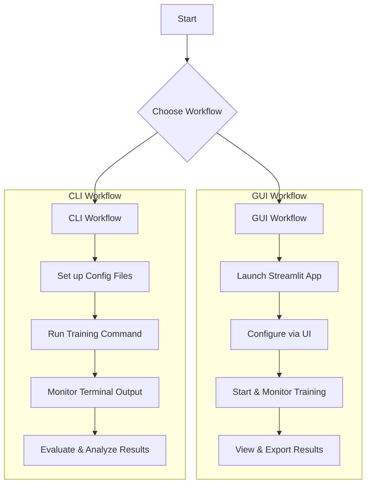

# Training Workflow Guide

This document provides a step-by-step guide to set up and run training for pavement
crack segmentation models using our modular framework. It covers both the command-line
(CLI) and Graphical User Interface (GUI) workflows.

**For professional development**, consult our standards in the `.cursor/rules/` directory,
which complement this technical guide.

## Workflow Overview



## Contents

- [Prerequisites](#prerequisites)
- [Project Structure](#project-structure)
- [GUI Workflow](#gui-workflow)
- [Configuration](#configuration)
- [Running Training (CLI Workflow)](#running-training-cli-workflow)
- [Model Evaluation](#model-evaluation)
- [Quality Standards](#quality-standards)
- [Troubleshooting](#troubleshooting)
- [Integration with Professional Development](#integration-with-professional-development)

## Prerequisites

Before you start, make sure you have the following:

### 1. Environment and Tools

```bash
# Set up conda environment
conda env create -f environment.yml
conda activate crackseg

# Install the module in editable mode for development (CRITICAL)
pip install -e . --no-deps

# Verify Python version (required: 3.12+)
python --version

# Verify package installation
python -c "import crackseg; print('✅ CrackSeg package imported successfully')"

# Check quality tools (mandatory)
black --version
ruff --version
basedpyright --version
pytest --version
```

### 2. Data Structure

Place your data in the appropriate structure as outlined in the project's main `README.md`.

### 3. Environment Variables

```bash
# Copy template and configure
cp .env.example .env
# Edit .env as needed
```

### 4. Initial Verification

```bash
# Ensure code meets professional standards (mandatory before training)
black .
python -m ruff . --fix
basedpyright .
pytest tests/ --cov=src --cov-report=term-missing
```

## Project Structure

The modular project structure allows flexibility in component selection. For detailed
organizational information, refer to the project's development standards.

### Configuration Components

- **Architectures**: `configs/model/architectures/`
- **Encoders**: `configs/model/encoder/`
- **Decoders**: `configs/model/decoder/`
- **Bottlenecks**: `configs/model/bottleneck/`
- **Loss Functions**: `configs/training/loss/`
- **Metrics**: `configs/training/metric/`
- **LR Schedulers**: `configs/training/lr_scheduler/`

For loss function details, see [Loss Registry Guide](loss_registry_usage.md).

## GUI Workflow

For an interactive experience, the project includes a Streamlit-based Graphical User Interface (GUI).

### 1. Launch the GUI

To start the application, ensure your conda environment is activated and run the following command
from the project root:

```bash
conda activate crackseg
streamlit run gui/app.py
```

The application will open in your default web browser.

### 2. Configure Training in the GUI

- **Configuration Page**: Navigate to the `Config` page from the sidebar. Here you can load a base
  YAML configuration and select a model checkpoint if you are resuming training.
- **Architecture Page**: Visualize the model architecture to ensure it matches your expectations.
- **Advanced Config Page**: Fine-tune specific parameters for the training session.

### 3. Start and Monitor Training

- **Train Page**: Once configured, go to the `Train` page.
- **Device Selection**: Choose the appropriate device (CPU or GPU).
- **Launch**: Click the "Start Training" button.
- **Monitoring**: The GUI provides real-time progress bars, metric charts (via TensorBoard
  integration), and log outputs.

### 4. View and Analyze Results

- **Results Page**: After training (or for a completed run), this page allows you to view prediction
  masks, analyze metrics, and browse a gallery of results.

## Configuration

### Main Configuration

The main configuration file is `configs/base.yaml`. You can override any
configuration directly from the command line using Hydra.

### Available Configurations

Explore available configurations:

```bash
# List available configurations
dir configs/

# Examine base configuration (now fixed)
cat configs/base.yaml

# Check basic verification config (optimized for testing)
cat configs/basic_verification.yaml
```

### Configuration Differences

**`base.yaml`** - Main configuration for production training:

- Full training setup with all components
- Standard batch sizes and image sizes
- Complete data augmentation pipeline
- Suitable for full experiments

**`basic_verification.yaml`** - Optimized for testing and verification:

- Reduced batch size (4) for faster processing
- Smaller image size (256x256) for memory efficiency
- Short training (2 epochs) for quick verification
- Limited data samples for testing
- Perfect for validating system functionality

### Configuration Examples

1. **Basic training with default configuration**:

    ```bash
    python run.py --config-name base
    ```

2. **Switch to SwinUNet architecture**:

    ```bash
    python run.py --config-name basic_verification model=architectures/unet_swin data.batch_size=4
    ```

3. **Use combined loss function**:

    ```bash
    python run.py --config-name basic_verification training.loss=bce_dice
    ```

4. **Configuration optimized for 8GB VRAM (RTX 3070 Ti)**:

    ```bash
    python run.py --config-name basic_verification \
                  data.batch_size=4 \
                  training.use_amp=true \
                  training.gradient_accumulation_steps=4
    ```

## Running Training (CLI Workflow)

For automated scripts and command-line enthusiasts, the CLI remains a powerful option.

### Basic Training

**IMPORTANT**: Use `run.py` instead of `src/main.py` for proper execution:

```bash
# Start training with the base configuration
python run.py --config-name base
```

### Training with Reproducibility Standards

To follow our ML research standards for reproducibility:

```bash
# Reproducible training with fixed seed
python run.py --config-name base \
              random_seed=42 \
              experiment.name="baseline_reproducible"

# Monitor GPU memory usage during training
python run.py --config-name base \
              training.verbose=true \
              data.batch_size=4 \
              training.use_amp=true
```

### Custom Experiment Configurations

Create custom experiment configurations:

```bash
# Create experiments directory
mkdir -p configs/experiments/my_experiments

# Create custom configuration
cat > configs/experiments/my_experiments/high_lr_experiment.yaml << 'EOF'
defaults:
  - base
  - _self_

training:
  learning_rate: 0.001  # Increased from default
  epochs: 50

dataloader:
  batch_size: 8
EOF

# Run custom experiment
python run.py --config-name high_lr_experiment
```

## Model Evaluation

After training, the model is evaluated on the test set.

### Running Evaluation

```bash
python -m src.evaluation.evaluate --checkpoint_path ... --config_path ...
```

### Evaluation Outputs

Evaluation results are saved in the experiment output directory.

## Quality Standards

All code and experiments must adhere to our strict quality standards. Refer to the
rules in the `.cursor/rules/` directory, which cover coding preferences, testing,
Git, and ML standards.

## Troubleshooting

### Common Issues

- **`CUDA out of memory`**: Reduce `data.batch_size`, enable `training.use_amp=true`,
  or use `training.gradient_accumulation_steps`.
- **`ModuleNotFoundError`**: Ensure you have activated the `crackseg` conda environment
  and installed the package with `pip install -e . --no-deps`.
- **`basedpyright` errors**: Check for complete and correct type annotations.
- **Import errors**: Verify package installation with `python -c "import crackseg"`.

### Getting Help

- For technical issues, consult our development guides and rule system.
- For bugs, open an issue in the repository with detailed logs.

## Integration with Professional Development

This training workflow is part of a larger professional development process.

### 📚 Essential Documentation

- **Task Management**: Refer to the project's Task Master guide.
- **Loss Registry**: See [Loss Registry Guide](loss_registry_usage.md).
- **Configuration Storage**: Review the specifications for configuration management.
- **Tutorials**: Follow the verified CLI tutorials in `docs/tutorials/cli/`.

### 🛠️ Key Principles

- **Evidence-Based**: All results must be supported by logs and metrics.
- **Reproducible**: Experiments must be repeatable.
- **Modular**: Components should be designed for reuse and independent testing.
- **Verified**: Use only tested and verified configurations and commands.

### ✅ Verified Commands and Configurations

The following have been tested and verified to work:

- **Entry Point**: `python run.py` (not `src/main.py`)
- **Base Config**: `base` (now fixed and working)
- **Testing Config**: `basic_verification` (optimized for quick testing)
- **Package Installation**: `pip install -e . --no-deps` (for conda environments)
- **Registry System**: Advanced multi-layer registry with lazy loading
- **Quality Gates**: `black .`, `python -m ruff . --fix`, `basedpyright .`

---

**This guide ensures that all training activities align with our professional
standards for creating a state-of-the-art crack segmentation system.**
