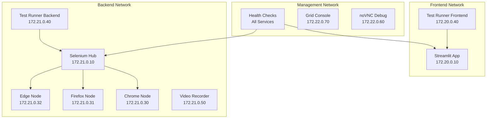

# CrackSeg Docker Testing Infrastructure - Master Guide

> **Complete E2E Testing Environment for Crack Segmentation Project**
>
> This infrastructure provides production-ready Docker testing with Selenium Grid, cross-browser
> support, multi-network architecture, and comprehensive monitoring.

## 🚀 Quick Start

### Local Development Setup

```bash
# 1. Initialize local development environment
./infrastructure/testing/scripts/setup-local-dev.sh

# 2. Validate system requirements
./infrastructure/testing/scripts/setup-local-dev.sh --validate

# 3. Start development environment
./infrastructure/testing/scripts/docker-stack-manager.sh start

# 4. Run tests
./infrastructure/testing/scripts/run-test-runner.sh run
```

### Docker Infrastructure Status

```bash
# Check infrastructure health
./infrastructure/testing/scripts/docker-stack-manager.sh health

# View service status
./infrastructure/testing/scripts/docker-stack-manager.sh status

# Monitor resources
./infrastructure/testing/scripts/system-monitor.sh dashboard
```

## 📚 Documentation Index

### **Core Documentation**

| Component | Documentation | Description |
|-----------|--------------|-------------|
| **🏗️ Architecture** | [README-ARCHITECTURE.md](README-ARCHITECTURE.md) | Complete system architecture and design decisions |
| **⚙️ Setup & Usage** | [README-USAGE.md](README-USAGE.md) | Step-by-step usage guide and workflows |
| **🔧 Local Development** | `infrastructure/testing/docs/README-LOCAL-DEV.md` | Local development environment setup |
| **🐛 Troubleshooting** | [README-TROUBLESHOOTING.md](README-TROUBLESHOOTING.md) | Common issues and solutions |

### **Specialized Documentation**

| Feature | Documentation | Description |
|---------|--------------|-------------|
| **🌐 Cross-Browser** | [README.cross-browser-testing.md](README.cross-browser-testing.md) | Multi-browser testing matrices and mobile emulation |
| **🔗 Network Setup** | `infrastructure/testing/docs/README.network-setup.md` | Multi-network architecture and security |
| **📦 Artifact Management** | [README.artifact-management.md](README.artifact-management.md) | Test results, videos, and report handling |
| **🔐 Environment Management** | `infrastructure/testing/docs/README.environment-management.md` | Environment variables and configuration |
| **📋 Docker Compose** | [docker-compose.README.md](docker-compose.README.md) | Service definitions and profiles |
| **🕸️ Selenium Grid** | [selenium-grid-guide.md](selenium-grid-guide.md) | Grid configuration and browser nodes |

## 🏗️ Infrastructure Overview

### System Architecture



### Key Features

- **🔄 Complete Test Automation**: Selenium Grid with multiple browser nodes
- **🌐 Cross-Browser Support**: Chrome, Firefox, Edge with mobile emulation
- **🛡️ Multi-Network Security**: Isolated frontend, backend, and management networks
- **📹 Video Recording**: Session recording for debugging and analysis
- **📊 Health Monitoring**: Comprehensive system health checks and alerts
- **🗂️ Artifact Management**: Structured test results and report collection
- **⚡ Performance Optimized**: Specialized containers and resource management

## 🛠️ Core Components

### 1. **Orchestration Scripts** (69,009+ lines)

| Script | Purpose | Size |
|--------|---------|------|
| `docker-stack-manager.sh` | Master orchestration and management | 810 lines |
| `e2e-test-orchestrator.sh` | End-to-end test execution and coordination | 900 lines |
| `browser-manager.sh` | Dynamic browser container management | 627 lines |
| `system-monitor.sh` | Resource monitoring and health checks | 705 lines |
| `artifact-manager.sh` | Test artifacts and report management | 857 lines |

### 2. **Specialized Test Runner**

- **Purpose-Built Container**: Optimized for test execution only
- **Multi-Stage Dockerfile**: Minimal dependencies, fast startup
- **Advanced Configuration**: Environment-based with sensible defaults
- **Comprehensive Artifact Collection**: Results, coverage, videos, logs

### 3. **Browser Matrix Support**

- **Desktop Browsers**: Chrome, Firefox, Edge (multiple versions)
- **Mobile Emulation**: Pixel 5, iPhone 12, Galaxy S21 Ultra
- **Test Matrices**: Smoke, compatibility, mobile, full matrix
- **Dynamic Management**: Runtime browser creation and cleanup

### 4. **Network Architecture**

- **Frontend Network** (172.20.0.0/24): Public-facing services
- **Backend Network** (172.21.0.0/24): Internal processing and automation
- **Management Network** (172.22.0.0/24): Administrative and monitoring

## 🎯 Common Workflows

### Development Workflow

```bash
# 1. Setup development environment
./tests/docker/scripts/setup-local-dev.sh

# 2. Start services
./tests/docker/scripts/docker-stack-manager.sh start

# 3. Run tests during development
./tests/docker/scripts/run-test-runner.sh run --browser chrome --coverage

# 4. Debug with video recording
./tests/docker/scripts/run-test-runner.sh run --videos --monitoring

# 5. Check results
./tests/docker/scripts/artifact-manager.sh list latest
```

### CI/CD Integration

```bash
# Production-ready test execution
./tests/docker/scripts/e2e-test-orchestrator.sh full-suite \
    --browsers chrome,firefox,edge \
    --parallel-workers 4 \
    --coverage \
    --artifacts-collection \
    --monitoring

# Cross-browser compatibility testing
./tests/docker/scripts/docker-stack-manager.sh test-cross-browser full_matrix
```

### Troubleshooting Workflow

```bash
# Check system health
./tests/docker/scripts/docker-stack-manager.sh health

# View detailed diagnostics
./tests/docker/scripts/system-monitor.sh diagnose

# Debug browser issues
./tests/docker/scripts/browser-manager.sh validate
./tests/docker/scripts/browser-manager.sh logs chrome:latest

# Clean and restart
./tests/docker/scripts/docker-stack-manager.sh cleanup
./tests/docker/scripts/docker-stack-manager.sh restart
```

## 🔧 Configuration Management

### Environment Configuration

- **Development**: `env.local.template` - Local development settings
- **Testing**: `env.test.template` - CI/CD test environment
- **Staging**: `env.staging.template` - Pre-production validation
- **Production**: `env.production.template` - Production deployment

### Service Access

- **Streamlit Application**: <http://localhost:8501>
- **Selenium Grid Console**: <http://localhost:4444>
- **Browser Debug Access**:
  - Chrome: <http://localhost:7900>
  - Firefox: <http://localhost:7901>
  - Edge: <http://localhost:7902>

## 📊 Performance & Monitoring

### System Requirements

- **CPU**: 4+ cores recommended
- **RAM**: 8GB minimum, 16GB recommended
- **Storage**: 10GB free space for artifacts
- **Docker**: 20.10+ with Compose V2

### Performance Optimization

```bash
# Resource monitoring
./tests/docker/scripts/system-monitor.sh dashboard

# Performance profiling
./tests/docker/scripts/system-monitor.sh profile tests/e2e/

# Memory analysis
./tests/docker/scripts/system-monitor.sh memory-analysis
```

## 🚀 Getting Started for New Developers

### 1. **Prerequisites Check**

```bash
# Verify Docker installation
docker --version
docker-compose --version

# Check system resources
./tests/docker/scripts/setup-local-dev.sh --validate
```

### 2. **Initial Setup**

```bash
# Clone and navigate to project
git clone <repository-url>
cd crackseg/tests/docker

# One-command setup
./setup-local-dev.sh
```

### 3. **First Test Run**

```bash
# Start infrastructure
./scripts/docker-stack-manager.sh start

# Wait for services
./scripts/docker-stack-manager.sh wait-ready

# Run your first test
./scripts/run-test-runner.sh run --browser chrome

# Check results
./scripts/artifact-manager.sh list latest
```

### 4. **Development Workflow**

```bash
# Daily start
./scripts/dev/start-testing.sh

# Run tests during development
./scripts/dev/run-tests.sh

# Debug failing tests
./scripts/run-test-runner.sh run --videos --debug

# Daily stop
./scripts/dev/stop-testing.sh
```

## 📋 CI/CD Integration Examples

### GitHub Actions

```yaml
name: Docker E2E Tests
on: [push, pull_request]

jobs:
  e2e-tests:
    runs-on: ubuntu-latest
    strategy:
      matrix:
        browser: [chrome, firefox, edge]

    steps:
    - uses: actions/checkout@v4

    - name: Setup E2E Infrastructure
      run: |
        cd tests/docker
        ./setup-local-dev.sh --ci
        ./scripts/docker-stack-manager.sh start --profile ci

    - name: Run E2E Tests
      run: |
        cd tests/docker
        ./scripts/e2e-test-orchestrator.sh run \
          --browser ${{ matrix.browser }} \
          --parallel-workers 2 \
          --coverage \
          --artifacts-collection \
          --ci-mode

    - name: Upload Artifacts
      if: always()
      uses: actions/upload-artifact@v4
      with:
        name: e2e-results-${{ matrix.browser }}
        path: tests/docker/test-artifacts/
```

### Jenkins Pipeline

```groovy
pipeline {
    agent any
    stages {
        stage('E2E Tests') {
            steps {
                sh '''
                    cd tests/docker
                    ./setup-local-dev.sh --ci
                    ./scripts/e2e-test-orchestrator.sh full-suite \
                        --browsers chrome,firefox,edge \
                        --parallel-workers 4 \
                        --coverage \
                        --ci-mode
                '''
            }
        }
    }
    post {
        always {
            archiveArtifacts artifacts: 'tests/docker/test-artifacts/**/*'
            publishTestResults testResultsPattern: 'tests/docker/test-results/junit.xml'
        }
    }
}
```

## 🔍 Troubleshooting Quick Reference

### Common Issues

| Issue | Quick Fix |
|-------|-----------|
| Services won't start | `./scripts/system-monitor.sh diagnose` |
| Tests failing | `./scripts/run-test-runner.sh run --debug --videos` |
| Browser not responding | `./scripts/browser-manager.sh restart chrome` |
| Performance issues | `./scripts/system-monitor.sh resources` |
| Disk space full | `./scripts/artifact-manager.sh cleanup --retention 3d` |

### Debug Commands

```bash
# System health check
./scripts/docker-stack-manager.sh health

# Service diagnostics
./scripts/system-monitor.sh diagnose

# View logs
./scripts/docker-stack-manager.sh logs --follow

# Reset environment
./scripts/docker-stack-manager.sh cleanup --rebuild
```

## 📖 Advanced Usage

### Custom Test Execution

```bash
# Run specific test patterns
./scripts/run-test-runner.sh run tests/e2e/test_specific.py

# Cross-browser testing
./scripts/docker-stack-manager.sh test-cross-browser smoke_test

# Performance testing
./scripts/run-test-runner.sh run -m performance --monitoring

# Parallel execution
./scripts/e2e-test-orchestrator.sh run --parallel-workers 8
```

### Advanced Monitoring

```bash
# Real-time monitoring dashboard
./scripts/system-monitor.sh dashboard

# Resource analysis
./scripts/system-monitor.sh analyze-resources

# Performance profiling
./scripts/system-monitor.sh profile --duration 300

# Network monitoring
./scripts/network-manager.sh monitor
```

## 🔗 Related Resources

### Documentation

- **Project Documentation**: [../../../docs/](../../../docs/)
- **API Documentation**: [../../../docs/api/](../../../docs/api/)
- **Training Workflow**: see `docs/guides/operational-guides/workflows/legacy/WORKFLOW_TRAINING.md`

### External References

- **Selenium Grid Documentation**: <https://selenium-grid.readthedocs.io/>
- **Docker Compose Reference**: <https://docs.docker.com/compose/>
- **pytest Documentation**: <https://docs.pytest.org/>

---

**Infrastructure Version**: 1.0 - Complete Docker Testing Environment
**Last Updated**: Task 13.11 - Documentation and Local Development Setup
**Compatibility**: CrackSeg v1.2+, Docker 20.10+, Python 3.12+
