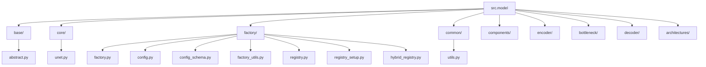

# Model Module

## Overview

The Model module provides a comprehensive framework for creating, configuring, and using
segmentation models based on the U-Net architecture. It follows a modular design pattern, allowing
for easy extension and customization of model components.

## Module Structure

Below is a diagram of the current modular structure of the model package:



This diagram reflects the main submodules and files in the modular structure. Each directory
contains focused components or utilities, supporting extensibility and maintainability.

The module is organized into several submodules:

- **base/**: Contains abstract base classes that define interfaces for model components
  - `abstract.py`: Defines `EncoderBase`, `BottleneckBase`, `DecoderBase`, and `UNetBase` abstract classes

- **core/**: Contains concrete implementations of the core model architecture
  - `unet.py`: Implements `BaseUNet`, the main model implementation

- **factory/**: Contains factory functions and utilities for model creation
  - `factory.py`: Main factory functions for creating models from configuration
  - `config.py`: Component instantiation from configuration
  - `config_schema.py`: Configuration schemas for components
  - `factory_utils.py`: Utility functions for configuration validation and transformation
  - `registry.py`: Registry system for model components
  - `registry_setup.py`: Setup for component registries
  - `hybrid_registry.py`: Support for hybrid architectures

- **common/**: Contains common utilities shared across model components
  - `utils.py`: Utility functions for model inspection and visualization

- **components/**: Implementation of specific components like attention mechanisms
- **encoder/**: Encoder implementations (CNN, ResNet, etc.)
- **bottleneck/**: Bottleneck implementations
- **decoder/**: Decoder implementations
- **architectures/**: Specialized architecture variants

## Key Concepts

1. **Component-Based Design**: The model is divided into three main components:
   - **Encoder**: Downsamples the input and extracts features
   - **Bottleneck**: Processes features at the lowest resolution
   - **Decoder**: Upsamples features and generates segmentation output

2. **Abstract Interfaces**: Base classes define consistent interfaces for components.

3. **Registry System**: Components can be registered and retrieved by name.

4. **Factory Pattern**: Factory functions instantiate components and models from configuration.

5. **Configuration Schema**: Dataclasses define the structure of component configurations.

## Usage Examples

### Basic Usage with Default Configuration

```python
from crackseg.model.architectures.cnn_convlstm_unet import CNNConvLSTMUNet as UNet
from crackseg.model.factory.factory import create_unet
from omegaconf import OmegaConf

# Load configuration
config = OmegaConf.load('configs/model/default.yaml')

# Create model
model = create_unet(config)

# Forward pass
output = model(input_tensor)
```

### Creating Components Individually

```python
from crackseg.model.encoder.cnn_encoder import CNNEncoder

from crackseg.model.decoder.cnn_decoder import CNNDecoder


# Create components
encoder = CNNEncoder(**encoder_config)
bottleneck = BottleneckBlock(**bottleneck_config, runtime_params={'in_channels': encoder.out_channels})
decoder = CNNDecoder(**decoder_config, runtime_params={
    'in_channels': bottleneck.out_channels,
    'skip_channels_list': list(reversed(encoder.skip_channels))
})

# Assemble model
model = instantiate_hybrid_model(encoder, bottleneck, decoder)
```

## Extension Points

1. **Custom Encoders**: Implement `EncoderBase` and register with the encoder registry.
2. **Custom Bottlenecks**: Implement `BottleneckBase` and register with the bottleneck registry.
3. **Custom Decoders**: Implement `DecoderBase` and register with the decoder registry.
4. **Custom U-Net Variants**: Implement `UNetBase` for specialized architectures.

## Configuration

Configuration is managed using OmegaConf and Hydra. Key configuration files:

- `configs/model/default.yaml`: Default U-Net configuration
- Various specialized configurations for different models

## Note on Reorganization (May 2025)

The model module was reorganized in May 2025 to improve modularity and maintainability:

1. Abstract base classes are now in `base/abstract.py`
2. The main UNet implementation is in `architectures/unet.py`
3. Factory and registry functionality is in the `factory/` module
4. Common utilities are in `common/utils.py`

Backward compatibility is maintained via `__init__.py`, but it is recommended to use the new
explicit import paths for clarity and maintainability.

## Migration Notice

All documentation, code examples, and import statements have been updated to reflect the new
modular structure. For legacy code, prefer updating imports to the new structure for long-term maintainability.

## Final Status

- All model components and utilities are organized by function and purpose.
- The structure supports modularity, extension, and independent testing.
- All files are documented and versioned with the codebase.

## Structure

- **bottleneck/**: Building blocks for bottleneck layers used in encoder/decoder architectures.
- **decoder/**: Decoder modules for segmentation models.
- **encoder/**: Encoder modules for segmentation models.
- **utils.py**: Utility functions for model analysis, parameter counting, receptive field
  estimation, memory usage, and architecture visualization (Graphviz).
- **unet.py**: Main UNet and BaseUNet class definitions, using modular blocks and utilities.

## Key Components

### 1. BaseUNet & UNet Classes (`unet.py`)

- Implements the core UNet architecture.
- Uses modular encoder, decoder, and bottleneck blocks.
- Delegates parameter counting, receptive field estimation, and architecture visualization to
  utility functions in `utils.py`.
- Designed for easy extension and integration with Hydra-based configuration.

### 2. Utilities (`utils.py`)

- **Parameter Counting:** Functions to count total and trainable parameters of a model.
- **Receptive Field Estimation:** Estimate the receptive field for each layer/block.
- **Memory Usage Estimation:** Approximate memory requirements for a given input size.
- **Layer Hierarchy Extraction:** Retrieve a structured summary of the model's layers.
- **Architecture Visualization:** Generate a Graphviz diagram of the model architecture.

All utility functions are documented with concise docstrings and are tested independently.

## Usage

- **Importing Models:**

  ```python
  from crackseg.model.architectures.cnn_convlstm_unet import CNNConvLSTMUNet as UNet
  ```

- **Using Utilities:**

  ```python
  from crackseg.model.common.visualization import count_parameters, render_unet_architecture_diagram
  ```

- **Visualization Example:**

  ```python
  model = UNet(...)
  render_unet_architecture_diagram(model, output_path="unet_architecture.png")
  ```

## Testing

- All major components and utilities are covered by unit tests in `tests/model/`.
- Utilities are tested with mocks to ensure independence from specific model implementations.

## Extending

- To add new architectures, create a new file or submodule following the modular pattern.
- Place reusable blocks in the appropriate subdirectory (`encoder/`, `decoder/`, `bottleneck/`).
- Add new utilities to `utils.py` if they are of general use.
- Update or add tests as needed.

## Dependencies

- All dependencies are managed via Conda (`environment.yml`) and pip (`requirements.txt`).
- Visualization requires `graphviz` (ensure both Python package and system binaries are installed).

## Conventions

- Follow PEP8 and project coding guidelines.
- Keep docstrings minimal and in English.
- Do not hardcode configuration; use Hydra for all parameters.
- Do not introduce new files or directories without explicit confirmation and documentation updates.

## Understanding and Navigating the Modular Structure

The modular structure of `src.model` was adopted to maximize maintainability, extensibility, and
clarity. Each submodule encapsulates a specific responsibility, making it easier to:

- Extend or replace components (e.g., encoders, decoders, bottlenecks) without affecting unrelated code.
- Test and document each part independently.
- Onboard new contributors by providing clear boundaries and responsibilities.

### Module Overview

- **base/**: Abstract interfaces for all model components.
- **core/**: Core implementations (e.g., main UNet logic).
- **factory/**: Factories, registries, and configuration utilities for dynamic model/component creation.
- **common/**: Shared utilities (e.g., parameter counting, visualization).
- **components/**: Specialized building blocks (e.g., attention, normalization).
- **encoder/**, **bottleneck/**, **decoder/**: Concrete implementations of each architectural block.
- **architectures/**: Specialized or experimental model variants.

### Best Practices

- **Explicit Imports**: Always import from the most specific submodule
  (e.g., `from crackseg.model.architectures.cnn_convlstm_unet import CNNConvLSTMUNet as UNet`) for
  clarity and IDE support.
- **Configuration**: Use Hydra/YAML for all parameters; avoid hardcoding.
- **Extending**: Add new components in the appropriate subdirectory and register them if needed.
- **Testing**: Place tests in `tests/model/` and use mocks for utilities.
- **Documentation**: Update this README and diagrams when the structure changes.

### For Contributors

- Follow PEP8 and project coding guidelines.
- Do not introduce new files or directories without explicit confirmation and documentation updates.
- When adding new modules, update the mermaid diagram and this section.

For more details, see the [project-structure.mdc](../../.cursor/rules/project-structure.mdc).

## Model Architecture Features

### Encoder-Decoder Design

The CrackSeg models use an encoder-decoder architecture optimized for crack segmentation:

- **Encoder**: Feature extraction with hierarchical representations
- **Decoder**: Progressive upsampling with skip connections
- **Skip Connections**: Multi-scale feature fusion for preserving fine details
- **Bottleneck**: Feature processing at the lowest resolution

### Model Capabilities

- **Multi-scale crack detection**: From hairline cracks (1-2 pixels) to large structural damage
- **Class imbalance handling**: Specialized loss functions for sparse crack patterns
- **Memory efficiency**: Optimized for RTX 3070 Ti (8GB VRAM) constraints
- **Modular design**: Composable components via Hydra configuration
- **Performance monitoring**: FLOPs counting, parameter estimation, memory usage, and architecture visualization

### Architecture Visualization

**✅ NEW**: Matplotlib-based Visualization (Default)

- Built-in matplotlib backend for architecture diagrams
- No external dependencies required
- Cross-platform compatibility
- Multiple output formats (PNG, PDF, SVG)

**⚠️ LEGACY**: Graphviz Support (Optional)

- Available for users who have graphviz installed
- Automatic fallback from matplotlib if requested

```python
from crackseg.model.common.visualization import render_unet_architecture_diagram

# Use matplotlib (default - recommended)
render_unet_architecture_diagram(hierarchy, "arch.png", view=True)

# Force matplotlib with custom size
render_unet_architecture_diagram(
    hierarchy, "arch.pdf", backend="matplotlib", figsize=(16, 10)
)

# Auto-select backend (matplotlib first, then graphviz if available)
render_unet_architecture_diagram(hierarchy, "arch.png", backend="auto")
```

## Key Benefits

- **Thin Structure Detection:** Optimized for detecting 1-5 pixel width cracks
- **Edge Preservation:** Maintains crack boundaries with high precision
- **Multi-Scale Processing:** Handles crack patterns at different scales
- **Memory Efficient:** Designed for consumer GPUs (RTX series)
- **Architecture Visualization:** Generate architecture diagrams with matplotlib backend
- **Modular Configuration:** Easy experimentation with different components

### Requirements

- **PyTorch 2.7+**: Core deep learning framework
- **Python 3.12+**: Modern Python with type hints support
- **CUDA-compatible GPU**: Recommended for training (RTX 3070 Ti or better)
- **Matplotlib**: For architecture visualization (automatically included)
