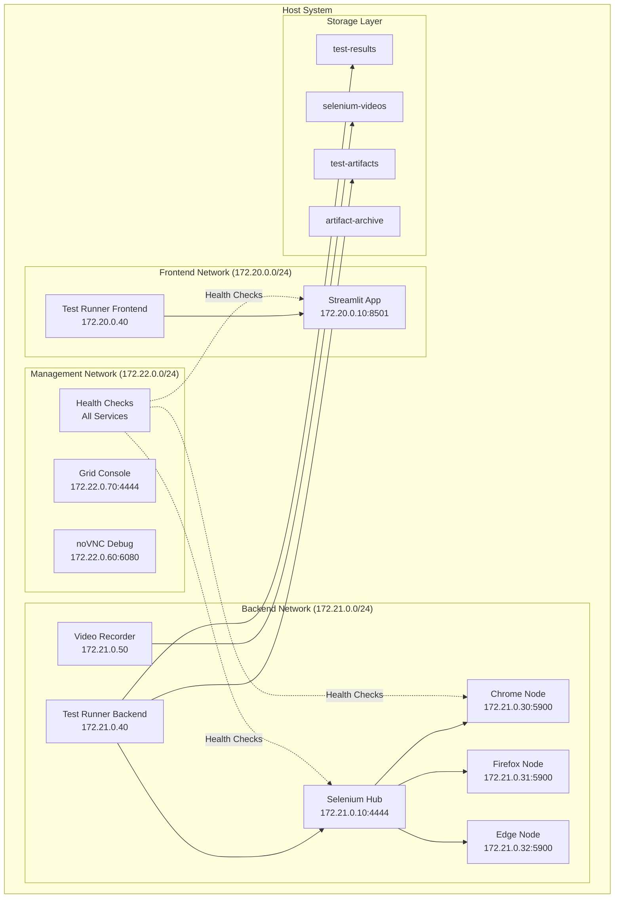
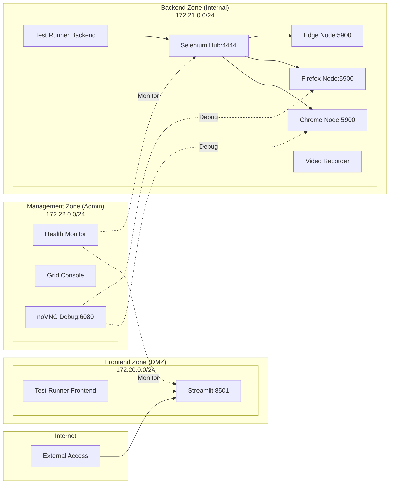
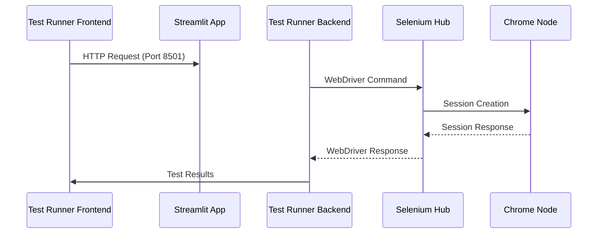
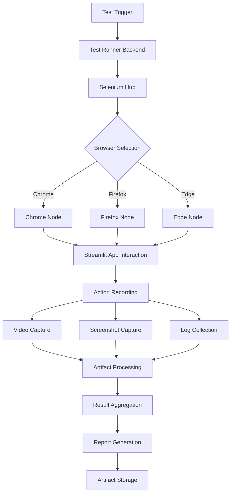
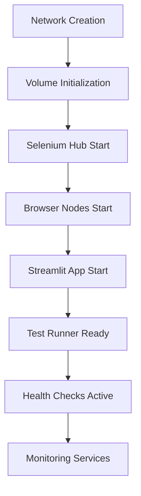
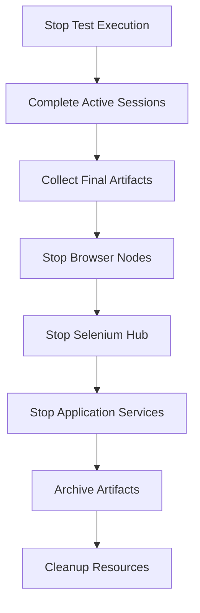

# CrackSeg Docker Testing Infrastructure - Technical Architecture

> **Production-Grade E2E Testing Architecture for Crack Segmentation Project**
>
> Complete technical specification of the multi-network Docker infrastructure with Selenium Grid,
> cross-browser support, artifact management, and comprehensive monitoring systems.

## Table of Contents

1. [System Overview](#system-overview)
2. [Container Architecture](#container-architecture)
3. [Network Architecture](#network-architecture)
4. [Service Discovery & Communication](#service-discovery--communication)
5. [Data Flow & Processing](#data-flow--processing)
6. [Orchestration Patterns](#orchestration-patterns)
7. [Storage Architecture](#storage-architecture)
8. [Security Model](#security-model)
9. [Design Decisions](#design-decisions)

## System Overview

### High-Level Architecture



### Core Components

| Component | Purpose | Technology | Network |
|-----------|---------|------------|---------|
| **Streamlit App** | Main application under test | Python/Streamlit | Frontend |
| **Selenium Hub** | Browser automation orchestration | Selenium Grid 4.27.0 | Backend |
| **Browser Nodes** | Test execution environments | Chrome/Firefox/Edge | Backend |
| **Test Runner** | Pytest execution environment | Python/Pytest | Backend/Frontend |
| **Video Recorder** | Session recording for debugging | FFmpeg/VNC | Backend |
| **Health Monitor** | System health and diagnostics | Python/Docker API | Management |

## Container Architecture

### Multi-Stage Container Design

#### 1. **Test Runner Container** (`Dockerfile.test-runner`)

```dockerfile
# Multi-stage build for optimized testing
FROM python:3.12-slim as base
# Base dependencies and environment setup

FROM base as test-dependencies
# Test-specific dependencies (pytest, selenium, etc.)

FROM test-dependencies as runtime
# Final runtime with application code
```

**Key Features:**

- **Minimal Runtime**: Only production dependencies in final stage
- **Layer Caching**: Optimized rebuild times through strategic layering
- **Security**: Non-root user execution, minimal attack surface
- **Performance**: Optimized for fast startup and low memory usage

#### 2. **Streamlit Application Container** (`Dockerfile.streamlit`)

```dockerfile
FROM python:3.12-slim as base
# Application dependencies from requirements.txt

FROM base as runtime
# Streamlit application with crack segmentation models
```

**Specialized Configuration:**

- **Model Loading**: Pre-loaded PyTorch models for crack segmentation
- **GPU Support**: CUDA-compatible for RTX 3070 Ti integration
- **Port Management**: Configurable port binding (default 8501)
- **Health Checks**: Built-in readiness and liveness probes

### Browser Node Specialization

#### **Chrome Node Configuration**

```yaml
selenium-chrome:
  image: selenium/node-chrome:4.27.0
  environment:
    - HUB_HOST=selenium-hub
    - NODE_MAX_INSTANCES=2
    - NODE_MAX_SESSION=2
    - SE_VNC_NO_PASSWORD=1
    - SE_SCREEN_WIDTH=1920
    - SE_SCREEN_HEIGHT=1080
  shm_size: 2gb  # Shared memory for stability
```

#### **Firefox Node Configuration**

```yaml
selenium-firefox:
  image: selenium/node-firefox:4.27.0
  environment:
    - HUB_HOST=selenium-hub
    - NODE_MAX_INSTANCES=2
    - NODE_MAX_SESSION=2
    - SE_VNC_NO_PASSWORD=1
  volumes:
    - /dev/shm:/dev/shm  # Shared memory optimization
```

#### **Edge Node Configuration**

```yaml
selenium-edge:
  image: selenium/node-edge:4.27.0
  environment:
    - HUB_HOST=selenium-hub
    - NODE_MAX_INSTANCES=1  # Lower due to resource usage
    - NODE_MAX_SESSION=1
    - SE_VNC_NO_PASSWORD=1
```

## Network Architecture

### Multi-Network Isolation Model

#### **Network Segmentation Strategy**



#### **Security Boundaries**

| Network | Security Zone | Access Level | Purpose |
|---------|---------------|--------------|---------|
| **Frontend** | DMZ (Demilitarized Zone) | Public | User-facing services |
| **Backend** | Internal | Restricted | Test execution and automation |
| **Management** | Administrative | Admin Only | Monitoring and debugging |

### Port Allocation Strategy

#### **Frontend Network Ports**

- `172.20.0.10:8501` - Streamlit Application
- `172.20.0.40:8080` - Test Runner Frontend Interface

#### **Backend Network Ports**

- `172.21.0.10:4444` - Selenium Hub
- `172.21.0.30:5900` - Chrome Node VNC
- `172.21.0.31:5900` - Firefox Node VNC
- `172.21.0.32:5900` - Edge Node VNC
- `172.21.0.40:8000` - Test Runner Backend API
- `172.21.0.50:8080` - Video Recording Service

#### **Management Network Ports**

- `172.22.0.60:6080` - noVNC Web Interface
- `172.22.0.70:4444` - Grid Console
- `172.22.0.80:8080` - Health Monitoring Dashboard

## Service Discovery & Communication

### Inter-Service Communication Patterns

#### **1. Service-to-Service Discovery**

```python
# Example: Test Runner → Selenium Hub Communication
SELENIUM_HUB_URL = "http://selenium-hub.crackseg-backend-network:4444/wd/hub"

# Docker DNS Resolution Pattern
# <service-name>.<network-name>:<port>
```

#### **2. Health Check Propagation**

```yaml
healthcheck:
  test: ["CMD", "curl", "-f", "http://localhost:4444/wd/hub/status"]
  interval: 30s
  timeout: 10s
  retries: 3
  start_period: 40s
```

#### **3. Cross-Network Communication**



## Data Flow & Processing

### Test Execution Data Flow



### Artifact Management Pipeline

#### **Processing Stages**

1. **Collection Phase**
   - Screenshots from browser nodes
   - Video recordings from VNC sessions
   - Test logs from pytest execution
   - Performance metrics from monitoring

2. **Processing Phase**
   - Video compression and format optimization
   - Log parsing and error extraction
   - Metric aggregation and analysis
   - Report template generation

3. **Storage Phase**
   - Immediate storage in `test-artifacts` volume
   - Archival to `artifact-archive` for retention
   - Cleanup of temporary processing files
   - Metadata indexing for retrieval

## Orchestration Patterns

### Script-Based Orchestration Architecture

#### **Primary Orchestration Scripts**

| Script | Lines | Purpose | Dependencies |
|--------|-------|---------|--------------|
| `docker-stack-manager.sh` | 810 | Master container lifecycle management | Docker, Docker Compose |
| `e2e-test-orchestrator.sh` | 900 | End-to-end test execution coordination | Test Runner, Browser Nodes |
| `browser-manager.sh` | 627 | Dynamic browser container management | Selenium Hub, Docker API |
| `system-monitor.sh` | 705 | Resource monitoring and health checks | Docker Stats, Custom Metrics |
| `artifact-manager.sh` | 857 | Test artifact collection and processing | Volume Mounts, File System |

#### **Orchestration Workflow Patterns**

```bash
# 1. Environment Preparation
./scripts/setup-local-dev.sh --validate
./scripts/setup-env.sh --environment=test

# 2. Infrastructure Startup
./scripts/docker-stack-manager.sh start --profile=full
./scripts/system-monitor.sh start

# 3. Test Execution
./scripts/e2e-test-orchestrator.sh run \
    --browsers=chrome,firefox,edge \
    --parallel-workers=4 \
    --coverage \
    --artifacts-collection

# 4. Cleanup and Archival
./scripts/artifact-manager.sh archive --retention=30d
./scripts/docker-stack-manager.sh cleanup
```

### Service Dependency Management

#### **Startup Order Dependencies**



#### **Graceful Shutdown Sequence**



## Storage Architecture

### Volume Management Strategy

#### **Volume Types and Purposes**

| Volume | Type | Purpose | Retention | Size Management |
|--------|------|---------|-----------|-----------------|
| `test-results` | Bind Mount | Test execution outputs | Configurable | Auto-rotation |
| `test-artifacts` | Bind Mount | Structured test artifacts | 7 days | Compression |
| `selenium-videos` | Bind Mount | Session recordings | 3 days | Auto-cleanup |
| `artifact-archive` | Bind Mount | Long-term storage | 30 days | Compression + Dedup |
| `artifact-temp` | Docker Volume | Processing workspace | 1 day | Auto-cleanup |

#### **Storage Lifecycle Management**

```python
# Artifact Manager Storage Policy
STORAGE_POLICIES = {
    "test-results": {
        "retention_days": 7,
        "compression": "gzip",
        "auto_cleanup": True
    },
    "selenium-videos": {
        "retention_days": 3,
        "compression": "h264",
        "size_limit": "10GB"
    },
    "artifact-archive": {
        "retention_days": 30,
        "compression": "tar.xz",
        "deduplication": True
    }
}
```

### File System Organization

```txt
test-artifacts/
├── runs/
│   ├── 2024-01-15_14-30-25/
│   │   ├── screenshots/
│   │   ├── videos/
│   │   ├── logs/
│   │   └── reports/
│   └── latest -> 2024-01-15_14-30-25/
├── archived/
│   ├── 2024-01/
│   └── 2024-02/
└── temp/
    └── processing/
```

## Security Model

### Container Security

#### **Security Hardening Measures**

1. **Non-Root Execution**

   ```dockerfile
   # All containers run as non-root users
   RUN groupadd -r crackseg && useradd -r -g crackseg crackseg
   USER crackseg
   ```

2. **Minimal Attack Surface**
   - Only necessary packages installed
   - Unused ports closed
   - Debug tools removed in production builds

3. **Resource Limits**

   ```yaml
   deploy:
     resources:
       limits:
         cpus: '2.0'
         memory: 4G
       reservations:
         memory: 2G
   ```

#### **Network Security**

1. **Network Segmentation**
   - Frontend: Public access (controlled exposure)
   - Backend: Internal services only
   - Management: Administrative access only

2. **Inter-Service Communication**
   - Service-to-service via Docker DNS
   - No direct container-to-host networking
   - Firewall rules via Docker networks

### Secrets Management

```yaml
# Environment-based secret injection
environment:
  - GRID_PASSWORD_FILE=/run/secrets/grid_password
  - API_KEY_FILE=/run/secrets/api_key

secrets:
  grid_password:
    file: ./secrets/grid_password.txt
  api_key:
    file: ./secrets/api_key.txt
```

## Design Decisions

### Architectural Trade-offs

#### **Multi-Network vs Single Network**

**Decision**: Multi-Network Architecture

- **Rationale**: Better security isolation, clearer service boundaries
- **Trade-off**: Increased complexity vs improved security posture
- **Alternative Considered**: Single network with port-based isolation

#### **Script-Based vs Docker Stack Orchestration**

**Decision**: Shell Script Orchestration

- **Rationale**: Greater flexibility, easier debugging, cross-platform compatibility
- **Trade-off**: More maintenance overhead vs operational flexibility
- **Alternative Considered**: Docker Swarm stack deployment

#### **Bind Mounts vs Named Volumes**

**Decision**: Bind Mounts for Artifacts

- **Rationale**: Direct file system access, easier debugging, backup integration
- **Trade-off**: Platform dependency vs accessibility
- **Alternative Considered**: Named volumes with backup containers

### Performance Optimizations

#### **Container Startup Optimization**

1. **Multi-Stage Builds**: Reduce final image size by 60%
2. **Layer Caching**: Strategic COPY operations for dependency caching
3. **Parallel Service Startup**: Non-blocking service initialization
4. **Resource Pre-allocation**: Defined CPU and memory reservations

#### **Test Execution Optimization**

1. **Parallel Browser Sessions**: Up to 4 concurrent test executions
2. **Shared Memory Configuration**: 2GB SHM for browser stability
3. **Connection Pooling**: Persistent WebDriver connections
4. **Artifact Streaming**: Real-time artifact collection

### Monitoring and Observability

#### **Health Check Strategy**

```yaml
# Comprehensive health monitoring
healthcheck:
  test: ["CMD", "./health-check.sh", "--service=selenium-hub"]
  interval: 30s
  timeout: 10s
  retries: 3
  start_period: 60s
```

#### **Metrics Collection**

- **Container Metrics**: CPU, memory, network, storage
- **Application Metrics**: Response times, error rates, test success rates
- **Infrastructure Metrics**: Docker daemon health, network connectivity
- **Business Metrics**: Test coverage, defect detection rates

#### **Log Aggregation**

```bash
# Centralized logging pattern
docker-compose logs --follow --tail=100 selenium-hub
docker-compose logs --timestamps --since="1h" streamlit-app
```

## References

### Related Documentation

- **Usage Guide**: [README-USAGE.md](README-USAGE.md)
- **Local Development**: [README-LOCAL-DEV.md](README-LOCAL-DEV.md)
- **Troubleshooting**: [README-TROUBLESHOOTING.md](README-TROUBLESHOOTING.md)
- **Network Setup**: [README.network-setup.md](README.network-setup.md)
- **Cross-Browser Testing**: [README.cross-browser-testing.md](README.cross-browser-testing.md)

### Technical Specifications

- **Selenium Grid**: Version 4.27.0
- **Docker Compose**: Version 3.8
- **Python**: 3.12+ (all containers)
- **Browser Versions**: Latest stable (Chrome, Firefox, Edge)
- **Network Architecture**: Multi-network with CIDR allocation
- **Storage**: Bind mount with lifecycle management

---

**Architecture Version**: 1.0 - Initial comprehensive documentation
**Last Updated**: 2024-01-15
**Review Cycle**: Monthly technical review required
